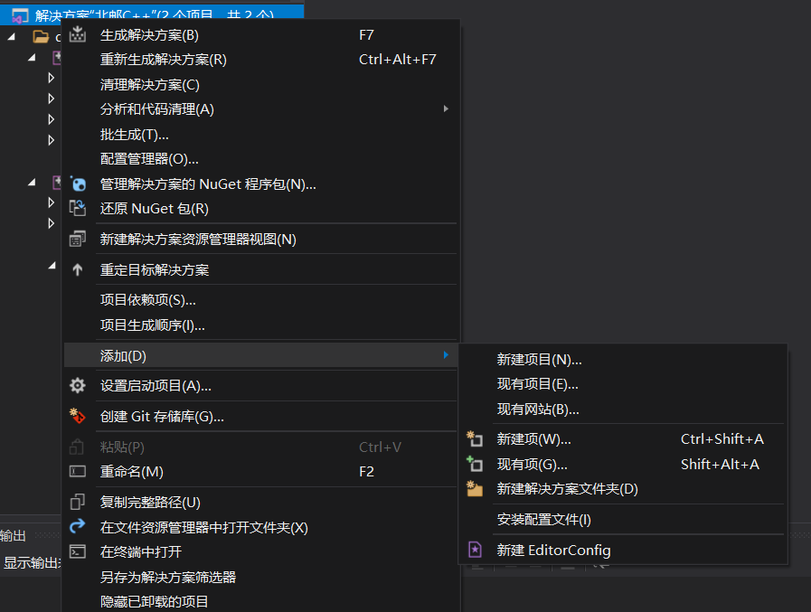
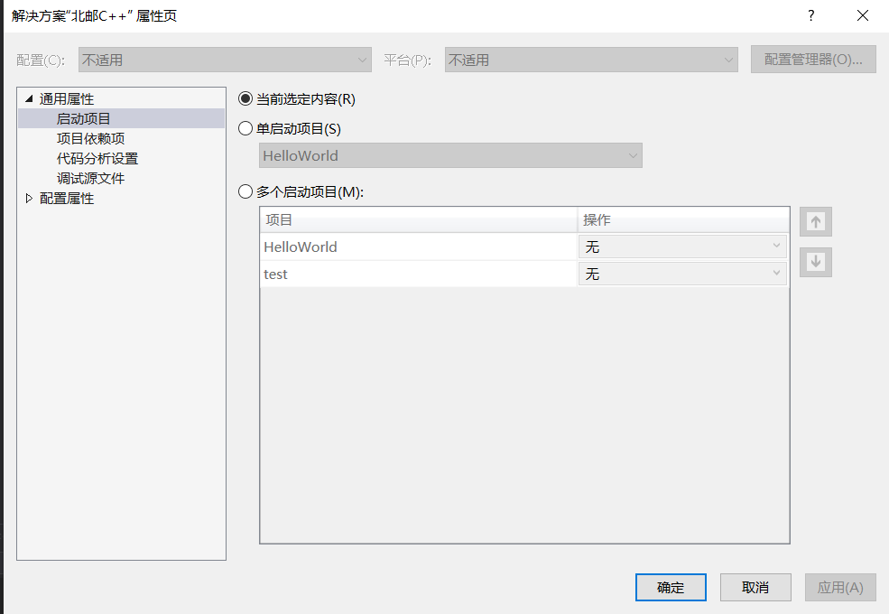

# 1 visual studio使用说明
## 1.1 解决方案     
``` sh
# visual studio是以解决方案为工程单位的
    解决方案 -> java项目
    项目 -> 包
```

## 1.2 项目文件夹
``` sh
# 一个解决方案可以创建多个项目文件夹对项目分类
项目文件夹 -> 对项目分类
```


## 1.3 启动项设置
``` sh
解决方案 -> 属性

# 当前选定内容：当前选定内容作为启动项
# 单启动项目：当前选定内容不作为启动项，要想使当前选定项目作为启动项，需要手动设置
```


# 2 常用快捷键