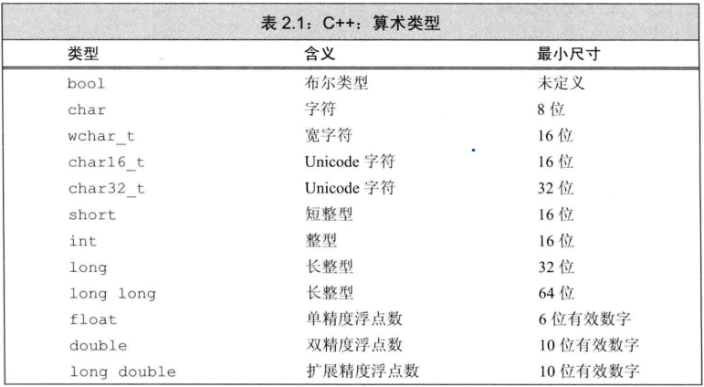
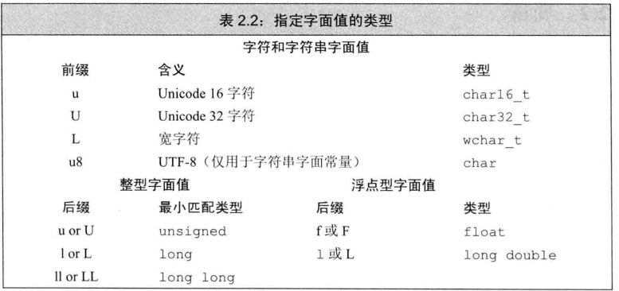
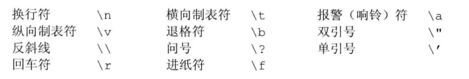

## 1 数据类型
介绍：数据类型分为基本类型和复合类型

**1.1 基本数据类型**
 - 算术类型
    - 整型
    ``` cpp
    //整型包括字符和布尔类型
    char
    short、int、long
    bool //bool类型命名最好用is作为前缀
    ```
    - 浮点型
    ``` cpp
    float、double
    ```
    - 空类型
    ``` cpp
    空类型void不对应任何值
    ```

**1.2 复合类型**
 - 引用
 - 指针
 - 数组
 - 类
 - 等等...

**1.3 char类型说明**
``` cpp
//字符型本质是整型
char c1 = '0';//字符0的ASCII码值 = 48
char c2 = 48;

char c3 = '\0';//字符\0的ASCII值为0,表示空格
char c4 = 0;
```

**1.4 c++类型**


## 2 类型转换
**2.1 bool类型转换规则**
``` cpp
//true
true -> 1  
非0 -> true

//false
false <-> 0
``` 

**2.2 浮点数和整型转换规则**
``` cpp
将浮点数赋值给整数类型时，截断保留小数点之前的部分
将整数赋值给浮点类型时，小数部分为0
```

**2.3 无符号和有符号之间的转换规则**
``` cpp
位模式不变，改变解释方式
```

**2.4 隐式转换**
  - 低类型自动向高类型转换
  - 有符号会向无符号转换

**2.5 注意**
 - `类型转换时要注意溢出问题`
 - 同时含有无符号和类型转换的表达式时：先进行类型转换，然后进行有符号向无符号的转换
 
## 3 字面值常量
**介绍**
形如42的值被称为字面值常量，每个字面值常量都对应一种数据类型。字面值常量的具体类型由书写的格式决定
> int i = 42; //十进制有符号的int类型
> double i = 42; //十进制有符号的double类型


**3.1 整型和浮点型字面值**
``` cpp
//以20为例
20; //十进制
024; //八进制
0x14; //十六进制
/*
1. 整型字面值具体数据类型由它的值和符号决定
2. 默认情况下十进制是有符号数，八进制和十六进制可能是带符号的也可能是无符号
*/
```

`字面值没有负值，-42表示对42取反`

**3.2 字符和字符串字面值**
``` cpp
/*
1. 由单引号括起来的一个字符称为字符型字面
2. 由双引号括起来的称为字符串型字面值
*/
'a'; //字符字面值
"hello,world" //字符串字面值
```

`C++字符串字面值继承了C，是以\0结尾的字符数组，并不是标准库<string>里真正的string类型`

**3.3 指令字面值常量的数据类型**


**3.4 指针和bool类型字面值**
`nullptr是指针字面值，表示0`
`true`，`false`表示bool类型字面值常量

## 4 转义序列：
**4.1 介绍**
``` cpp
有两类字符不能直接使用
    1. 一类是不可打印字符，如退格或其他控制字符，因为它们没有可视的图
    2.另一类是在C++中有特殊含义的字符，如果想要将这些字符当作普通字符使用，需要使用转义序列，转义序列以反斜线开始
```

**4.2 有哪些转义序列?**


`在程序中，这些转义序列被当作一个字符使用`

补充：我们还可以使用泛化的转义序列，形式是\x后跟十六进制数字，或\后跟八进制数字，其中数字部表示的是所采用的字符集中该字符对应的数值