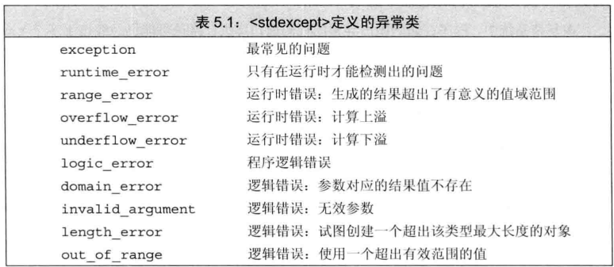

\<exception>头文件定义了最通用的异常类exception。它只报告异常的发生，不提供任何额外信息

\<stdexcept>头文件定义了几种常用异常类。

\<new>头文件定义了bad_alloc异常类型。

\<type_info>头文件定义了bad_cast异常类型。

每个标准异常类都定义了名为what的成员函数，这些函数没有参数。返回值是C风格字符串

exception、bad_alloc、bad_cast只能以默认初始化的方式初始化，不能赋予它们初始值。其他异常类则相反，当它们创建对象时，必须提供初始值string对象或C风格字符串