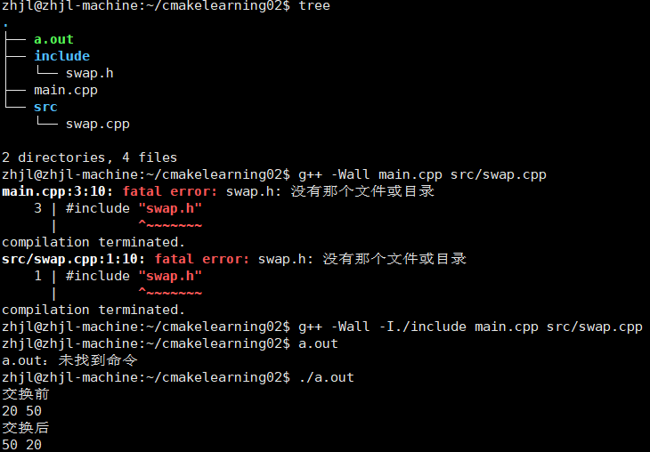
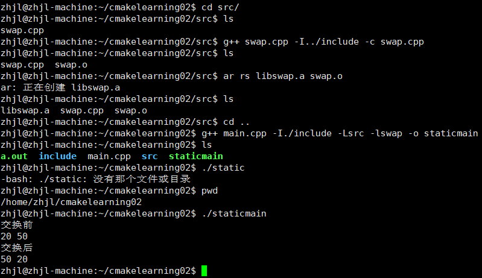
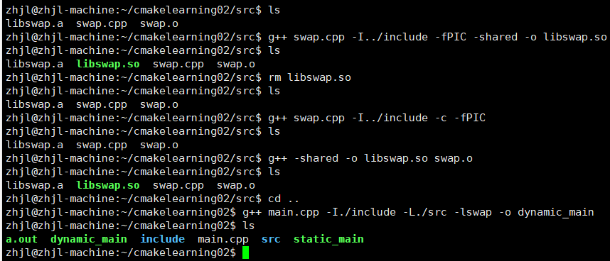
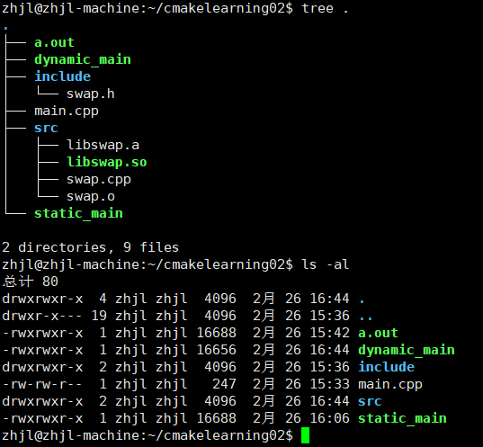

# 直接编译
- 最简单的编译
    ``` sh
    g++ main.cpp ./src/swap.cpp
    # 报错
    ```
- 添加参数编译
    ``` sh
    g++ -I./include main.cpp src/swap.cpp
    # -I./include指定了头文件搜素目录
    ```
    


# 生成库文件并编译
- 生成静态库
    ``` sh
    # 生成静态库libswap.a
    cd ./src

    g++ swap.cpp -I../include -c swap.cpp
    # -I指定头文件搜索路径
    # -c生成二进制文件

    ar rs libswap.a swap.o
    # ar rs lib库名.a .o文件名

    cd ..
    g++ main.cpp -L./src -lswap -o staticmain
    # -L指定搜索库的路径，-l指定库名
    ```
    

---

- 生成动态库
    ``` sh
    # 生成静态库libswap.so
    cd ./src
    g++ swap.cpp -I../include -fPIC -shared -o libswap.so

    #等价于
    g++ swap.cpp -I../include -c -fPIC
    g++ -shared -o libswap.so swap.o
    ```
    


# 静态库和动态库区别
- 区别如下
    ``` sh
    1.静态库更方便，动态库省内存
        dynamic_main内存 < static_main内存
    2.
        静态库在**运行前**把库文件装进程序
        动态库在**运行时**把库文件装入程序
    
    3. 同时存在静态库和动态库，链接时优先链接动态库
    ```
    

- 运行可执行文件：
    ``` sh
    # 运行静态库
    ./static_main

    # 运行动态库
    # LD_LIBRARY_PATH=src指定了动态库搜索路径
    LD_LIBRARY_PATH=src ./dynamic_main
    ```