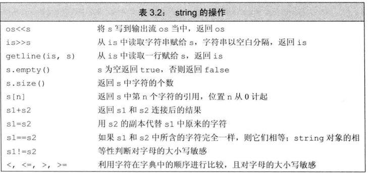
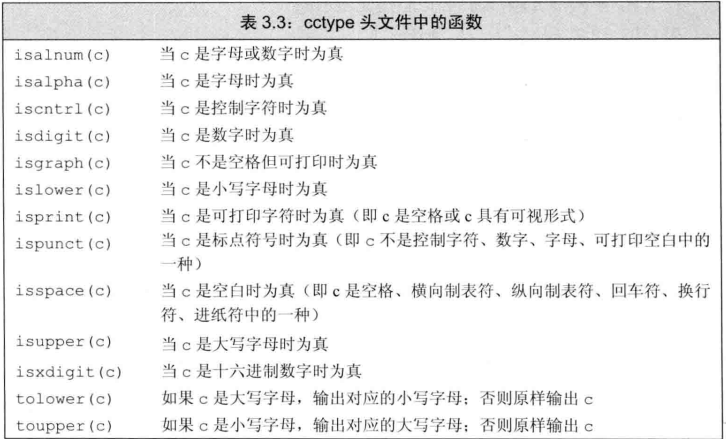

### string
string是C++提供的标准库类型，表示可变长的字符序列，string定义在命名空间std和头文件string中

注意：由于历史原因和为了兼容C。C++中的字符串字面值和string头文件里的字符串不是同一数据类型。
  - C++ string中的字符串是C++自己定义的
  - C++的字符串字面值是继承自C的C风格字符串。C风格字符串是一种约定，并不是真正的字符串，而是以'\0'结尾的字符数组

string支持的操作：


### 读取string对象
cin读取string对象时，一次读取一个字符串，遇见空白停止输入。

getline读取string时，一次读取一行，遇到换行符停止输入，并丢弃换行符

cin：
``` cpp
#include <iostream>
#include <string>
using std::string;
using std::cout;
using std::cin;

int main(void)
{
  //1.读取单个字符
  string s;//默认初始化为空字符串
  cin>>s;//读取一个字符，遇见空白结束

  //2.读取多个字符
  string s;
  while(cin>>s)//反复读取，直到达到文件末尾
  {
    cout<<s;
  }
}
```

getline()：
``` cpp
#include <iostream>
#include <string>
using std::string;
using std::cout;
using std::cin;

int main(void)
{
  //格式：getline(输入流，string对象)
  string s;
  //每次读入一整行，直到文件末尾
  while(getling(cin,s))
  {
    cout<<s<<endl;
    //getline读取时，不会读取行尾的换行符，需要手动加上换行符。使用ednl结束当前行并刷新显示缓冲区
  }
```
---
这里提一下C++的运算符重载:

例如std::string的输入运算符号>>和getline()函数的输入运算符>>处理字符串时具有不同的表现
  - std::string的<<运算符会自动忽略字符串开头的一切空白，从真正的字符开始读起，直到遇到下一处空白停止。
  - getline()的>>运算符会依次读取一行，会包含空白。直到遇到换行符为止，此时换行符也会被读取进来，但换行符会被丢弃，不会存储在最后的字符串中。

### empty和size操作
empty，字符串为空返回true，不为空返回false。

size，返回string对象的长度(即string对象中的字符个数)。说明：size返回的不是int类型，而是返回string::size_type类型。
> size_type是一个无符号整型值，因此在有size()函数的表达式中不能使用int，这样可以避免无符号和有符号之间转换可能带来的问题。

### 比较string对象
说明：在比较string对象时，是根据字典顺序进行比较的，并且大小写敏感

==和!=检验两个对象是否相等或不相等。相等指的是它们长度相同，并且每个位置的字符也相同

<、<=、>、>=比较string对象之间的大小关系。

### 赋值给string对象
``` cpp
string s1(10,'c'),s2;//初始化s1为连续10个c组成的字符串,s2被默认初始化为空字符串
s1 = s2;//s1是s2的副本
s1 = "hello";//s1是字面值hello的副本
```

### 字面值和string对象相加
``` cpp
//说明：如果一种类型和我们所需要的类型不同时，如果这种类型可以自动转换为需要的类型，那么我们也可以使用它。而标准库允许字符字面值和字符串字面值转换为string类型，C风格字符串转化为string类型时会丢掉'\0'。

//1.可以使用字符串字面值和字符字面值初始化string对象。因为字符串字面值继承自C风格字符串，在初始化和赋值给string对象时会丢弃掉'\0'

//2.string对象之间可以使用+相加，string对象也可以和C风格字符串使用+相加，此时C风格字符串会丢掉'\0'转化为string类型。当把string对象和字符字面值以及字符串字面值混在一条语句中使用时，必须确保每个加法运算符(+)的两侧的运算对象至少有一个是string，这样保证了C风格字符串可以转化为string对象。
string s1{};
string s2 = s1+"hello";//正确
string s3 = "hello" + "";//错误：两个对象都不是string
string s4 = "hello"+""+s1;//错误：第一个+号两侧的运算对象不是string
string s5 = "hello"+(""+s1);//正确
string s = "" + "";//错误：不能把字面值直接相加

//注意：由于历史原因以及为了兼容C，所以C++中的字符串字面值并不是标准库类型string的对象。切记：字符串字面值与string 是不同的类型
//注意：c语言的标准库头文件格式为name.h。c++的标准库头文件格式为name，没有任何后缀；c++兼容的c的头文件格式为cname。在c++中如果想要使用c语言的标准库，应使用cname，不要使用name.h，不然可能引起一些兼容性的问题。
#include <srting.h>//c标准库
#include <string>//c++标准库
#include <cstring>//c++兼容的c的标准库
```


### 操作单个字符


### 遍历string
遍历方式1：range-for语句
``` cpp
for (declar:expr)
  statement
//expr部分是一个对象，用于表示一个序列。delclar负责定义一个比变量，该变量用于访问序列中的基础元素。每次迭代时，declar会初始化为expr序列的下一个元素，类似java的增强for循环

//注意：在使用range-for时，declar是一个临时变量，每次迭代时是用expr序列的初始化declar。他并不是序列中的元素，如果需要改变序列中元素的值，需要将declar声明为引用。

```

遍历方式2：普通for语句+[]下标运算符
  - []接收的参数是string::size_type类型的值，这个参数表示要访问字符的索引，返回值是索引处的字符的引用。

遍历方式3：迭代器

## c++14的字符串字面量
c++14将运算符`""s`进行了重载
``` cpp
using namespace std::string_literals;

auto s1 = "hello"s;//s1是 std::string 类型
auto s2 = std::string{"hello"};//和上面等

auto s3 = "hello";//s3是const char*类型
```