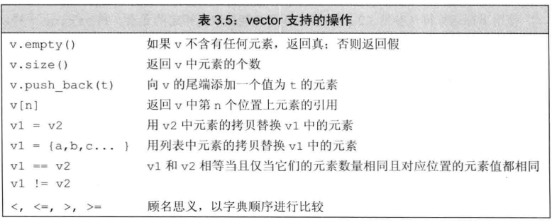

### vector
标准库类型vector表示对象的集合，其中所有对象的数据类型都相同。集合中的每个对象都有一个对应的索引。因为vector容纳着其他对象，所以它常被称为容器(container)。vector定义在命名空间std和头文件vector中

注意：vector是对象的集合，引用不是对象，所以vector里面不能包含引用

c++既有类模板，也有函数模板。vector是一个类模板。类似java的泛型类和泛型函数

模板本身不是类或函数，模板可以看作为编译器生成类或函数编写的一份说明。编译器根据模板创建类或函数的过程称为实例化，当使用模板时，要用<>给出额外信息，指定模板到底实例化成什么样的类或函数。例如
``` cpp
vector<int> ivec;//ivec保存int类型的对象
vector<string> svec;//svec保存string类型的对象
vector<vector<int>> vvec;//vvec保存vector<int>类型的对象

/* 个人理解：
1.模板实例化，编译器生成模板类或模板函数的过程。例如
    假设模板vector<T>，令vector<int>，此时编译器会根据<>内给出的额外信息生成具体的模板类
2.类的实例化，类创建实体的过程。例如
    假设有一个Person类，Person p;的过程称为类的实例化。一般说的实例化是指类的实例化
3.对于模板本身不是类或函数的个人理解：
    vector<T>表示vector是一个模板
    vector<int>表示一个保存int元素的类
    vector
*/
```

vector支持的操作：


### 初始化vector对象
说明：下面的初始化规则vector和string相同

``` cpp
vector<int> v1{};//执行默认初始化,vec是一个空vector，不包含任何元素
vector v(n,val);//有n个元素，元素初始值都是val。括号初始化会将参数视为元素数量和元素初始值
vector<int> v{n,val};//包含了两个元素,分别是n和val。列表初始化会将参数视为元素初始值的列表

```

### 向vector对象中添加元素
格式：对象.push_back(element e)
  - push_back负责把一个值当成vector对象的尾元素压到(push)到vector对象的尾端(back)

vector元素数量可以高效增长，在定义vector对象时没必要指定大小，这样可能会使性能更差


### 其他vector操作
size，返回vector的元素个数。返回的类型是vector::size_type。要使用size_type，需要先指定它是由哪种类型定义的。

empty，vector为空返回true，否则返回false。

### 遍历vector对象
遍历方式1：range-for语句
``` cpp
for (declaration:expression)
  statement
//expr部分是一个对象，用于表示一个序列。declar负责定义一个比变量，该变量用于访问序列中的基础元素。每次迭代时，declar会初始化为expr序列的下一个元素，类似java的增强for循环

//注意：在使用range-for时，declar是一个临时变量，每次迭代时是用expr序列的初始化declar。他并不是序列中的元素，如果需要改变序列中元素的值，需要将declar声明为引用。
```

遍历方式2：普通for语句+[]下标运算符
  - []接收的参数是string::size_type类型的值，这个参数表示要访问元素的索引，返回值是索引处的元素的引用。

遍历方式3：迭代器

### 使用vector的隐晦要求
1)特别：在使用range-for语句和迭代器遍历容器和string这种序列时，不能修改容器大小，即不能向容器中添加或删除元素。因为底层维护了迭代器，如果修改容器大小，会破坏迭代器。