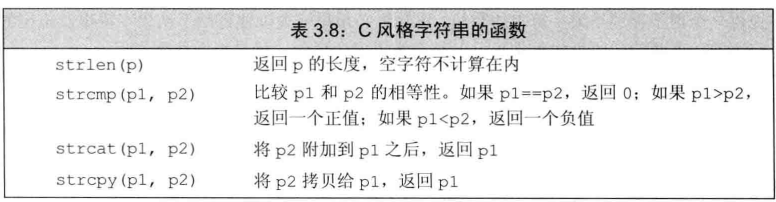

### 数组
数组也是存放类型相同的对象的容器，这些对象没有名字，需要通过索引访问。数组大小是固定不变的。如果不清楚元素的确切个数，请使用vector。

数组是一种复合类型。声明形如int a[d],d是维度也就是数组大小。数组大小必须是一个常量表达式。

定义数组时：必须指定类型，不允许使用auto关键字由初始值列表推断类型，使用auto返回的是数组首地址。

和vector一样，数组的元素应该是对象，因此不存在引用的数组

### 字符数组初始化的特殊性
字符数组除了常规的几种初始化方式外，还有一种特殊的初始化方式，也就是使用字符串字面值初始化。

注意：当使用这种方式 ，一定要注意字符串字面值结尾还有一个空字符'\0'，这个字符也会向其他字符一样被拷贝到字符数组中。
```  cpp
char a1[]{'a','b','c'};
char a2[]{"abc"};
//a1：abc a2：abc'\0'
```

### 不允许数组赋值给数组
不允许数组初始化或赋值给其他数组：
``` cpp
int a[]{0,1,2,};
int b[] = a;//error，不允许用数组给其他数组赋值
```

特别的：一些编译器支持数组的赋值，这就是所谓的编译器扩展，但最好不好使用非标准特性，含有非标准特性的程序很可能在其他编译器上无法正常工作。

### 数组初始化vector
允许数组初始化或赋值给vector对象，需要指明数组的首元素地址和尾后地址
  ``` cpp
    #inluce <vector>
    #inluce <iterator>
    int arr[10]{};
    std::vector<int> ivec{std::begin(arr),std::end(arr)};
  ```
### 理解数组的复杂声明
和vector一样，数组能存放大多数类型的对象，例如可以定义存放指针的数组。同时数组本身也是对象，因此可以定义数组的指针和数组的引用
  ``` cpp
  int *p[10];//p是含有十个int*指针的数组
  int &r[10];//错误：引用不是对象，不存在引用的数组
  int (*pp)[10];//pp指向一个含有10个整数的数组
  int (&rr)[10];//rr引用了一个含有十个整数的数组
  ```

说明：一般情况下，我们声明时是从右往左看。但如果是含有数组的声明时，我们最好从变量开始由内向外看更容易弄清楚声明的含义


### 访问数组元素
数组通过下标运算符[]来访问元素，和vector的[]不同。数组的下标运算符是由C++语言直接定义的，用在数组类型的对象上，而vector的下标运算符由标准库模板vector定义，用于vector类型的对象。

数组下标：
  - 在使用数组下标时，通常将其定义为size_t类型。size_t是一种机器相关的无符号类型，定义在cstddef中。
  - 虽然标准库类型string和vector也能执行下标运算，但是数组和它们还是有所不同。标准库限定的下标必须是标准库各自内部定义的无符号类型，而数组内置的下标没有此要求。

数组遍历方式：
  - 普通for语句
  - range-for语句

说明：当需要遍历数组时，最好使用range-for语句。因为维度是数组类型的一部分，所以系统知道数组元素个数，使用range-for语句可以减轻人为控制遍历过程的负担


### 指针和数组
在C++中，指针和数组联系十分紧密。数组有一个重要特性：在很多使用到数组名字的地方，编译器会自动将它替换为一个指向数组首元素的指针
>	string arr[10]{};
> string *p = arr;//等价于 string *p = &arr[0];

说明：
  - 指针是变量，用来存储地址
  - 数组名是一个地址(常量)

指针也是迭代器，就像使用迭代器遍历vector中元素一样，使用指针也可以遍历数组中的元素。
``` cpp
string arr[10]{};
string *b = arr;//获取begin
string *e = &arr[10];//获取end

//通过传统方法获取尾迭代器会有一定风险，C++11新标准引入了两个名为begin和end的函数。这两个函数与容器中的同名成员功能类似，这两个函数定义在头文件iterator中
string *b = begin(arr);//获取数组首元素的迭代器
string *e = end(arr);//获取数组的尾后迭代器
```

### C风格字符串
注意：尽管C++支持C风格字符串，但在C++中最好不要使用它们，这是因为C风格字符串使用起来不方便，而且容易引发程序漏洞。

C标准库string函数:

  - C风格字符串本质就是以'\0'结尾的字符数组，因此使用char*进行接收。并且传入此类函数的参数必须是以空字符结尾的字符数组。

本质上：*C语言中字符串本质上就是以'\0'结尾的字符数组*。而C++的字符串字面值继承了C风格字符串，但C++的string是自己定义在标准库string中的类型
``` cpp
//1.C语言没有字符串string类型，约定字符串是以'\0'结尾的字符数组
//2.C++的string是定义在标准库string中的，而字符串字面值继承自C风格字符串。hello本质上 = "hello\0",在表达式中会转化为string类型，str= "hello"
string str = "hello";
```

### 与旧代码的接口
现代C++为了与那些充满了C语言风格的代码(例如充满了C风格字符串的代码)，现代C++提供了一组功能，作为现代C++代码与旧C++代码之间的接口。

混用string对象和C风格字符串：
``` cpp
/*
* 前面介绍过，可以使用字符串字面值初始化或赋值给string对象。由于C++字符串字面值继承自C风格字符串，而C风格字符串是以'\0'结尾的字符数组。因此任何出现字符串字面值的地方都可以用以'\0'结尾的字符数组替代
1. 允许使用C风格字符串初始化string对象或赋值。
string str = "hello";
2.允许将C风格字符串和string对象通过+相加。需要遵守一定规则。(在02string.md中)
string s = "hello"
string str = s+"world";
3.上面两个性质反过来就不再成立，如果程序某处需要一个字符串数组时，不能用string对象初始化或赋值给指向字符的指针(字符数组),标准库string提供了一个c_str的成员函数，用来返回C风格字符串。
char *pstr = "hello";//正确：字符数组在表达式中转化为指针
char str = "hello";
char *pstr = str;//错误：不能用string对象赋值给char*类型
char *pstr = str.c_str();//正确
```

### 建议
使用指针和数组很容易出错，指针常用于底层操作，因此容易引发一些错误。现代C++程序应尽量使用vector和迭代器、避免使用内置数组和指针，应该使用string、避免使用C风格字符串