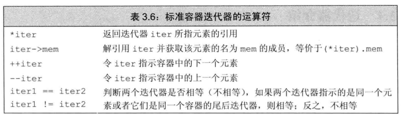
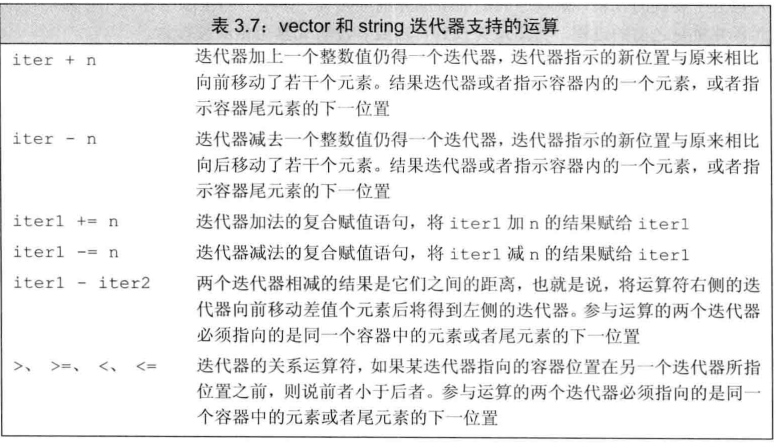

### 迭代器
目前为止我们可以通过下标运算符[]和范围for语句来访问string和vector对象的元素。除此，我们还可以使用迭代器进行访问容器和string

除了vector之外，标准库还定义了其他几种类型的容器，所有容器都可以使用迭代器，但是只有少数几种才支持下标运算符。string不是容器，但string支持很多与容器类似的操作，因此string也可以使用迭代器

类似于指针，迭代器也是提供了对对象的间接访问。迭代器的对象是容器中的某个元素或string中的某个字符。使用迭代器可以访问某个元素，迭代器也能从一个元素移动到另外一个元素。迭代器也分有效和无效，这一点和指针差不多。有效迭代器指向某个元素或者容器中尾元素的下一位置，其他都属于无效。

### 使用迭代器
和指针不同，获取迭代器不是使用&符号，有迭代器的类型同时拥有返回迭代器的成员，这些类型都拥有begin和end成员
  - begin成员负责指向第一个元素的迭代器
  - end成员负责返回指向容器“尾元素的下一位置”的迭代器，也就是说该迭代器指示的是容器的一个根本不存在的“尾后元素”，没有实际意义，仅仅是个标记而已，表示我们已经处理完了容器中的所有元素。end成员返回的迭代器通常被称为尾(后)迭代器
  - 特别的：如果容器为空，begin和end返回的都是同一个迭代器，都是尾后迭代器

STD container(标准容器)迭代器的运算符：

  - 和指针类似，迭代器也能通过解引用来获取它所指的元素。执行解引用的迭代器必须合法并指向某个元素。试图解引用一个非法迭代器或尾迭代器都是未被定义的行为
  - 迭代器使用递增(++)运算符来从一个元素移动到下一个元素。

vector和string迭代器支持的运算符：

- 注意：迭代器不支持迭代器＋迭代器的运算

### 迭代器类型
``` cpp
vector<int>::iterator it1;//it1能读写vector<int中的元素>
string::itertator it2;//it2能读写string对象中的字符
vector::const_iterator it3;//it3只能读元素，不能写元素
string::const_iterator it4;//it4只能读字符，不能写字符
```

> 前面说过，只有string和vector等少部分标准库类型有下标运算符[]，并非全部容器都有。与之类似的是，所有标准库容器的迭代器都定义了==和!=，但它们大多数都没定义<等运算符。因此，我们应养成使用迭代器和!=的习惯


### 前++ VS 后++(--同理)
  - 前置++先自增后执行表达式，后置++先执行表达式后自增
  - 前置++返回的是对象的引用，后置++返回的是const的临时对象
  - 效率上，前置++效率较高，因为后置++会产生临时对象
  - 优先级上，后置++大于前置++大于解引用*

