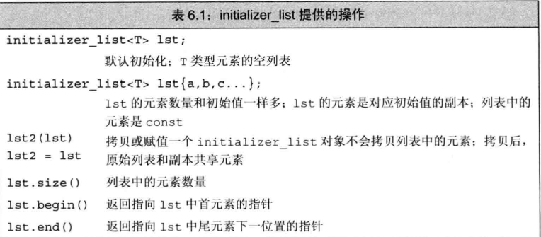

### 使用引用避免拷贝
传实参给形参时，拷贝大的类类型或者容器对象比较低效，甚至有的类类型(例如IO)根本不支持拷贝操作。当某个类型不支持拷贝操作时，函数只能通过引用形参访问该类型的对象

当不想修改对象内容时，使用const定义形参

如果不确定是否需要修改形参。在大多数情况下，建议使用const定义形参。

``` cpp
#include <iostream>
#include <string>

void prt(const string &str);
int main(void)
{
  string str{"hello"};
  prt(str);
  return 0;
}

void prt(const string &str)
{
  cout<<str;
}
```


### 使用引用形参返回额外信息
一个函数只能返回一个值，然后有时函数需要同时返回多个值，引用形参为我们一次返回多个结果提供了有效的途径。

例如：
``` cpp
//我们定义一个fin_char函数，要求返回string对象中某个某个指定字符第一次出现的位置。同时返回字符出现的总次数
std::string::size_type find_char(const &string,char c,std::string::size_type &count)
{
  auto first = s.size();//第一次出现的位置
  counts = 0;//统计出现次数
  for(decltype(first)i = 0;i!=s.size();++i)
  {
    if(s[i]==char) 
    {
      if(first = s.size())first = i;
      ++counts;
    }
  }
  return first;
}

string s{"hello"};
string::size_type counts;
auto index{find_char(s,'l'),counts};
```

### (指针或引用)形参 与const
**我们可以用非常量初始化一个底层const对象，但反过来不行**。一般来说非常量可以转换为常量，常量不能转换为非常量。

我们以引用为例，结论对指针也适用。
  ``` cpp
  int i{5};
  const int v{i};//正确
  const int *p{&i};//正确
  const int &r{i};//正确
  const int &rr{42};//正确，可以用字面值或表达式初始化常量引用

  const int j{5};
  int v1{j};//错误
  int *p1{&j};//错误
  int &r1{j};//错误
  int &rr1{42};//普通引用只能用对象初始化

  //以上初始化规则对参数传递也同样使用。
  ```


编程规范：把不会改变的形参定义为常量引用。如果将不会改变的形参定义为普通引用，会给函数调用者带来误导，即函数可以修改它的实参的值。而且普通引用也限制了函数所能接收实参类型

再探常量引用：
``` cpp
//如果对find_char有两种定义形参的方式，一种是使用const string &s,另一种是使用string &s
string::size_type find_char(const string &s,char c,string::size_type counts);
string::size_type find_char(string &s,char c,string::size_type counts);

bool is_sentence(const string &s){
  string::size_type counts{0};
  return fin_char(s,'.',counts) == s.size()-1 && counts == 1;
}
/*
刨析
  * 如果find_char使用的是第一种形式const string &s，那么就没有任何问题。
  * 如果find_char使用的是第二种形式string &s,那么编译时就会报错。原因是s是常量引用，但find_char是普通引用。

  解决方法：
    方法1.修改is_sentence的形参类型，这是错误的方法。这只是将错误转移到了is_sentence这个函数上
    方法2.正确方法是修改find_char的形参类型为const string &s
    方法3.如果find_char的类型实在不能修改，应该在is_sentence内部定义一个string tmp作为s的副本，然后将tmp传给find_char。
*/
```

### 数组形参
数组的两个特殊性质对我们定义和使用作用在数组的函数有影响。这两个性质分别是：不允许拷贝数组，使用数组名是通常会将其转换成指针。所以我们为函数传递数组时，实际上传递的是数组首元素的指针。

三种传参方式：
  - 值传递
  - 址传递
  - 引用传递

尽管不能以值形式方式，但我们可以把形参写成类似数组的形式
``` cpp
//下面三种形式等价
void print(const int*);
void print(const int[]);
void print(const int[10]);//10表示我们期望数组有多少元素，实际不一定
```

因为数组是以指针形式传递给函数，所以函数并不知道数组的确切大小。因此调用者要给函数传递一些额外信息告诉函数数组的大小。
``` cpp
//标准库规范传递数组参数，<iterator>里定义了数组首元素的迭代器和尾后迭代器
#include <iostream>
#include <iterator>
#include <cstddef>

//1.标准库规范
void prt1(const int *begin,const begin);
int main(void)
{
  int a[3]{1,2,3};
  fun(begin(a),end(a));
  return 0;
}
void prt1(const int *formal_begin,const int *formal_end)
{
  for(const int *p = formal_begin;p!=formal_end;++p;)
  {
    std::cout<< *p<<" ";
  }
}

//2.显示传递数组的大小
void prt2(const int *p,size_t size)
{
   for(size_t i = 0;i!=size;++i)
  {
    std::cout<< p[i]<<" ";
  }
}
```

### 数组引用形参
使用引用传递数组。
``` cpp
void print(const int (&arr)[10])
//注意：形参是数组的引用，维度是类型的一部分
{
  for(auto e:arr)
  {
    cout<<e<<endl;
  }
}
```

因为数组的大小是构成数组类型的一部分，所以只要不超过维度，在函数体内就可以放心地使用数组。但是这一用法同时也限制了print函数的可用型，print函数只能作用于大小为10的数组。
改进方法：通过模板，后面会学习。


### 传递多维数组
多维数组就是数组的数组，因为我们处理的是数组的数组，所以首元素本身就是一个数组，指针就是一个指向数组的指针。数组第二维后的所有维度的大小都是数组类型，不能省略。
``` cpp
int arr[2][2]{0};

void print(int (*p)[2],int rowsize);
//等价的
void print(int p[][2],int rowsize);
```

### main：处理命令行选项
向main函数传递实参是演示如何向函数传递数组的典型例子。
``` cpp
int main(int argc,char *argv[]){...}

//argc：表示数组中字符串的数量
//argv: 数组，它的元素是C风格字符串的指针，因此main函数也可以定义为
int main(int argc,char **argv){...}
//其中argv指向char**
```

当实参传递给main函数后，argv第一个元素指向程序的名字或者一个空字符串。后面的元素依次传递命令行提供的实参。最后一个指针之后的元素保证为0
``` cpp
//例如有一个名为pro的程序，我们向程序提供以下参数
pro -d -o ofile data0
argv[0] = "pro";
argv[1] = "-d";
argv[2] = "-o";
argv[3] = "ofile";
argv[4] = "data0";
argv[5] = 0;

argc = 5;

//当使用argv中的实参时，一定要记得可选实验从argv[1]开始。argv[0]保存程序名字，而非用户输入。
```

### 含有可变形参的函数
为了编写不同数量实参的函数，C++11新标准提供了两种主要的方法：
  - 如果所有实参类型相同，可以传递一个名为initializer_list的标准库类型。本节主要讨论这个
  - 如果实参类型不同，可以使用可变参数模板。在以后模板章节讨论

initializer提供的操作:


initializer_list定义在<initializer_list>中。

和vector一样，initializer_list也是一种模板类型。定义initializer_list对象时，必须说明列表所含元素类型。
``` cpp 
initializer_list<string> ls;
initializer_list<int> li;

//注意：和vector不同的是,initializer_list对象中的元素永远是常量值，我们无法修改元素的值。
```

如果想向initializer_list形参中传递一个值的序列，则必须把序列放在一对括号内：
``` cpp
void print(int size,initializer_list<string> list);

//调用函数
print(2,{"hello","world"});

print(3,{"hello","c++","world"};

```

---
还有一个特殊的形参类型(即省略符)，可以用来传递可变数量的实参。这种方式只用于与C函数交互的接口程序。
``` cpp
void fun(string s,...);
void fun(...);
```
> 省略符形参是为了兼容，方便C++访问某些特殊的C代码而设置的。
> 省略符形参应该仅仅用于C和C++都通用的类型。特别注意：大多数类型的对象在传递给省略形参时都无法正确拷贝。

