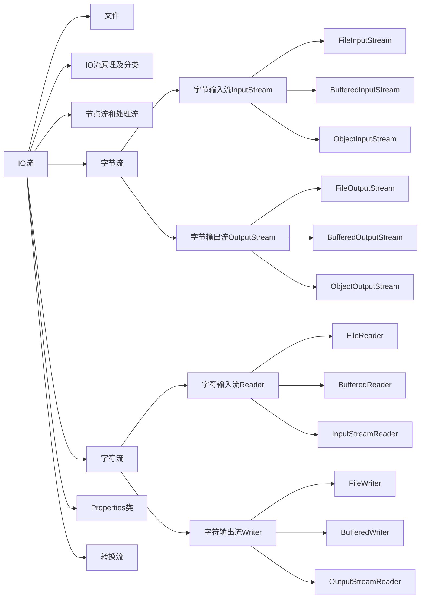
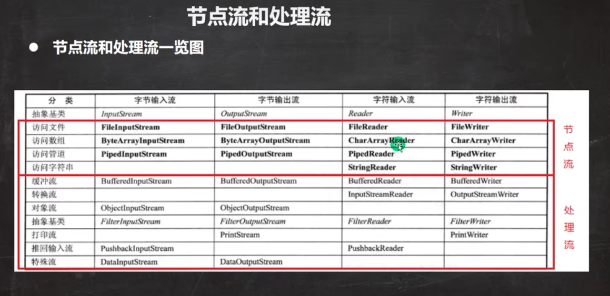

### IO流框架图

### IO流分类
IO流由4个抽象基类派生出来，每一个基类的实现子类又分为节点流和处理流
  -  
  - 节点流是对某一种特定的数据源进行操作。
  - 处理流采用修饰者模式，对节点流进行了包装处理。
    - 实例化处理流时，只需传入需要的节点流对象即可。底层实际是传入的节点流对象在操作数据。
    - 关闭处理流，只需要关闭最外层流即可。

> 给IO流传入File对象或文件路径后，此时该流对象与这个文件相关联。
  - 如果是输入流对象，文件数据则保存在了输入流对象中，我们便可以从输入流对象中读取数据；
  - 如果是输出流，我们便可以将程序中的数据通过输出流对象写入文件
> IO流使用完后必须调用close()方法关闭流资源，否则会无法成功写入等错误。

# 常用IO流
字节流下的节点流：
 - FileInputStream
 - OutputStream

字节流下的缓冲流：
 - BufferedInputStream
 - BufferedOutputStream。

字节流下的对象流：
 - ObjectInputStream(反序列化)
 - ObjectOutputStream(序列化)

字符流下的节点流：
 - FileReader
 - FileWriter

字符流下的缓冲流：
 - BufferedReader
 - BufferedWriter

转换流说明：
 - InputStreamReader、OutputStreamWriter。常用于解决编码方式不同时产生的不兼容问题，默认情况下读取文件是按UTF-8的方式读取，而有的文件可能不是UTF-8的编码方式。此时使用字节流读取文件可能会产生错误，这种情况下可以使用转换流将字节流转换为字符流，而字符流可以指定编码方式。

注意：
 - Properties(Map的实现类)常和IO流配合使用，从.properties文件中读取配置信息保存IO流对象中，然后加载到Properties对象中

# 文件
IO流与文件的关系：

输入：将外部(如磁盘等)的数据保存到输入流对象中(即内存中)

输出：将输出流对象中的数据(即内存中的数据)保存到外部(如磁盘等)

java程序中：IO流是内存与外部之间进行数据交互的桥梁(例如IO流是文件与Java程序之间数据交互的桥梁)

File对象的创建：
  - new File(String pathName);//文件绝对路径
  - new File(File parent,String child);//父目录File对象+父目录下的文件名
  - new File(String parent,String child);//父目录路径+父目录下的文件名

File常用方法：
  - getName;获取文件名
  - isFile;判断是否是文件
  - isDirectory;判断是否是目录
  - createNewFile();File对象是在内存中的。File对象执行createNewFile方法后才会在正确的位置创建文件，文件真正在磁盘上创建成功。createNewFile创建的是普通文件
  - mkdir()，mkdirs()创建目录和多级目录
  - delete删除普通文件或空目录

