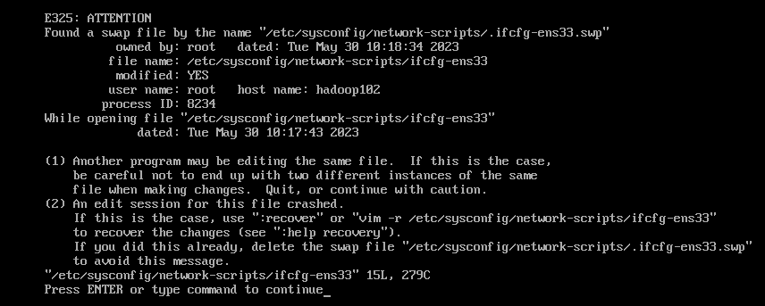
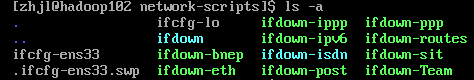

## 配置静态网络
### 配置
``` shell 
# 1.进入网络设置中心
sudo vim /etc/sysconfig/network-scripts/ifcfg-ens33

# 修改信息
TYPE=Ethernet
PROXY_METHOD=none
BROWSER_ONLY=no
BOOTPROTO=static # 修改为静态网络,可自定义ip
DEFROUTE=yes
IPV4_FAILURE_FATAL=no
IPV6INIT=yes
IPV6_AUTOCONF=yes
IPV6_DEFROUTE=yes
IPV6_FAILURE_FATAL=no
IPV6_ADDR_GEN_MODE=stable-privacy
NAME=ens33
UUID=40c77713-7e77-4d6b-a675-04649b9d91c8
DEVICE=ens33
ONBOOT=yes # yes表示ip addr和ifconfig时显示ip

# 2.添加以下信息
IPADDR=192.168.157.132
NETMASK=255.255.255.0
GATEWAY=192.168.157.2
DNS1=8.8.8.8
DNS2=114.114.114.114
# NAT模式下IPADDR=192.168.157.132和GATEWAY=192.168.157.2前三个字节（网络号）要与VMnet8网络相同

# 3.重启网络
service network restart
```
### vim编辑异常
问题：vim配置网络出现异常(.swap文件) 


解决方法：`ls -al找到.swap文件` -> 删除


## 访问github
绕过国内dns访问github
``` sh
# 搜索github.com获取网站IP：(https://www.ipaddress.com/)

# 配置/etc/hosts文件：添加github的ip和域名、DNS服务器的IP和域名

# 配置DNS为140.232.28.133 raw.githubusercontent.com

# github网址：140.82.113.3 github.com
```


## ifconfig不显示ip
``` sh
vim /etc/sysconfig/network-scripts/ifcfg-ens33
# 修改ONBOTT=no -> ONBOOT=yes
```