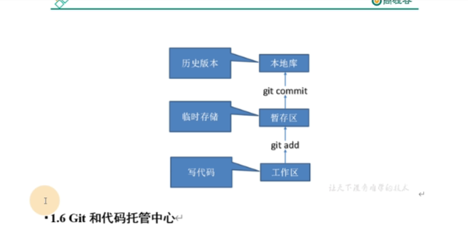

## 概述
Git是一个免费的、开源的分布式版本控制系统

Git占地面积小，性能快，具有廉价的**本地库(在本机磁盘上)**，方便的暂存区域和多个公共流分支等特性

everything-is-local

## 版本控制
版本控制是一种记录文件内容变化，以便将来查阅特定版本系统修订情况的系统

版本控制最重要的是可以记录文件修改历史记录，让用户能够查看历史版本，方便版本切换

## 版本控制工具
集中式版本控制系统：例如CVS，SVN等集中式版本控制

分布式版本控制系统：例如Git

## Git和代码托管中心

代码托管中心是基于网络服务的远程代码仓库，也叫远程库。

工作区、暂存区的代码都可以删除，**一旦提交到本地库就会生成一个历史版本，不再可以删除**。

本地库还可以推送到远程库。推送到远程库后，如果远程库是开源的，则所有人都可以访问。