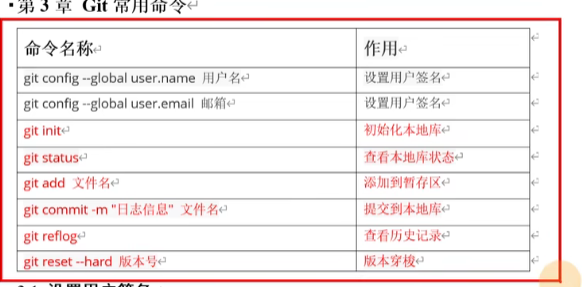

## 常用命令：
Git的命令和Linux的命令大部分是通用的



用户签名
 -  ``` sh
    首次安装git时，必须设置用户签名，否则无法提交代码
    ```
初始化
 -  ``` sh
    在执行git status、git add等命令之前，必须先git init初始化本地库

    git clone除外
    ```

## 用户签名设置
- 语法
    ``` sh
    git config --global user.name name
    git config --global user.email email
    ```
- 作用
    ``` sh
    签名作用是区分不同操作者身份
    
    用户的签名信息在每一个版本的提交信息中能够看到，以此确认本次提交是谁做的。

    签名和将来登录GitHub(或者其他代码托管中心)的账号没有任何关系
    ```
- 用户签名路径
    ``` sh
    C：/users/73866/.gitconfig
    ```

## 初始化init
- 语法
    ``` sh
    # 初始化本地库
    # 初始化完成后会生成.git文件，该文件负责管理本地仓库
    git init
    ```

## 本地库状态status
- 语法
    ``` sh
    # 查看本地库状态
    git status
    ```

## 添加暂存区add
- 语法
    ``` sh
    # 添加文件暂存区，即git追踪文件
    git add filename

    # git rm --cached filename可以删除暂存区的文件
    # 删除的是暂存区的文件，工作区的还在
    ```

## 提交commit
- 语法
    ``` sh
    # 将暂存区文件提交到本地仓库
    git commit -m "日志信息" 文件名
    ```

## 查看版本信息
- 语法
    ``` sh
    # 查看部分日志信息
    git reflog
    
    # 查看完整日志信息
    git log
    ```

## 修改文件
- 语法
    ``` sh
    vim filename
    ```

## 版本穿梭
- 语法
    ``` sh
    git reset --hard 版本号
    git reset --soft 版本号
    git reset --mixed 版本号
    ```

- 工作区、暂存区、本地版本库的关系：
    ``` sh
    我们的本地版本库维护了一个HEAD指针，这个指针可以指向本地库的各个提交版本
    
    我们的项目就在工作区，对于新建的文件必须先保存到暂存区，再commit到本地库；对于修改的文件可以先add再commit或者直接commit
    
    回退和前进commit版本，只是移动HEAD指针的位置，只要进行过commit，将永久保存，不会被删除，版本穿梭后可以通过git log（最详细）、git log --pretty=oneline（简化）、git log --oneline（上一个的简写）、git reflog(简化，但信息更多）获取到全部的commit的版本信息
    ```

- soft、hard、mixed区别
    ``` sh
    #
    soft，仅仅移动版本库HEAD指针，暂存区和工作区不会重置。HEAD指针只是指向了本地版本库的某个历史版本，工作区和暂存区没有重置为历史版本，还是当前的版本
    
    #
    mixed(混合)reset默认的参数，不指定reset类型就是它，移动版本库HEAD指针,重置暂存区，但不重置工作区。例如从当前版本回退到历史版本，工作区更改的文件和代码是不会变成历史版本的；暂存区则重置为了HEAD指针指向的历史版本

    #
    hard，移动版本库HEAD指针，重置暂存区和工作区。彻底回退到某个版本，本地的代码也会变为某个版本的内容，此命令慎用，如果真要用，建议先commit提交一份到本地库，后悔再reset回去
    ```

