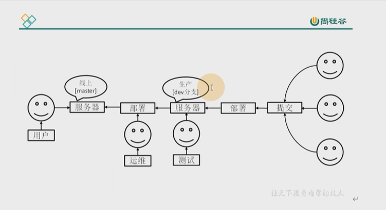
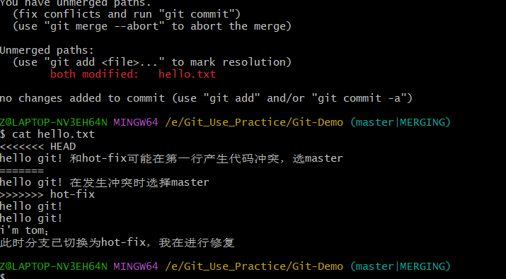

## 分支作用
在版本控制过程中，同时推进多个任务，为每个任务单独的分支。程序员可以将自己的任务从开发主线上分离，在自己的分支上开发自己的模块，即使某个分支开发失败也不会对其他分支产生影响。

各个分支可以和主线分支进行合并进行版本更新。分支可以理解为副本，一个分支就是一个副本。




## 分支命令
- 查看分支
    ```
    git branch -v
    ```
- 创建分支
    ``` sh
    git branch 分支名
    ```
- 切换分支
    ``` sh
    git checkout 分支名
    ```
- 分支合并
    ``` sh
    # 将指定分支合并到当前分支
    git merge 指定分支名

    # master|MERGING表示代码合并冲突
    # 提交合并分支时如果产生代码冲突，必须认为选择合并哪个分支的内容
    ```
    


    