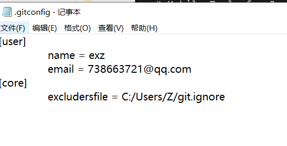
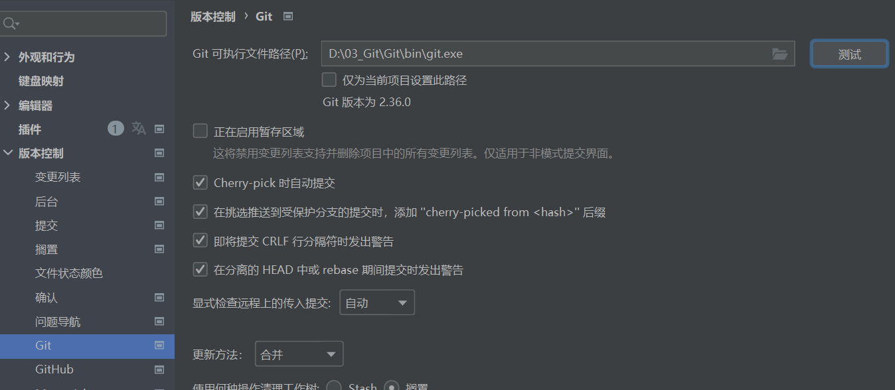
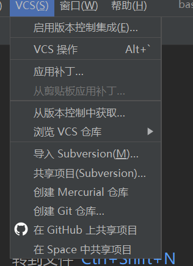

## Git配置信息路径
C:/Users/Username/gitconfig

## 配置Git忽略文件git.ignore
- 作用
    ``` sh
    在项目中，IDEA的xxx.idea和xxx.iml文件和项目没有关系，在实际运行项目时并不需要这些文件，配置git.ignore可以忽略不同IDE之间的差异。
    ```
- 配置
    `在Git配置信息所在目录C:\Users\Username\下建立git.ignore文件`
    ``` shell
    # Compiled class file
    *.class
    # Log file
    *.log
    # BlueJ files
    *.ctxt
    # Mobile Tools for Java (J2ME)
    .mtj.tmp/# Package Files #
    *.jar
    *.war
    *.nar
    *.ear
    *.zip
    *.tar.gz
    *.rar
    # virtual machine crash logs,see https://www.java.com/en/download/help/error_hotspot.xml
    hs_err_pid*
    .classpath
    .project
    .settings
    target
    .idea
    *.iml
    ```
- 引用git.ignore
    `在.gifconfig文件中引用git.ignore文件，这里引用目录只能用正斜线，不能使用反斜线`
    

## IDEA定位Git
- 定位Git
    `将IDEA里的Git可执行目录设为Git安装目录下的bin目录下的
    git.exe，确认后点击测试直到出现Git的版本信息`
    

## IDEA创建Git仓库
- IDEA创建仓库
    `点击VCS(版本控制系统)里的创建Git仓库后创建Git仓库，创建Git仓库也就是为这个项目创建.git文件,然后在IDEA中就可以对项目进行版本控制`
    