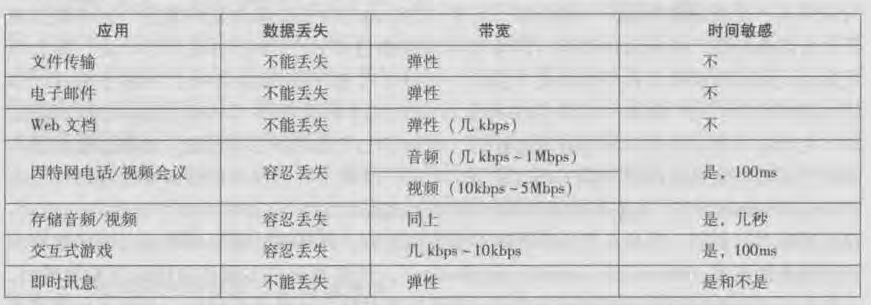

### 应用层协议原理
网络应用是计算机网络存的理由，网络应用程序是因特网成功的驱动力

经典应用举例：
  - 文本电子邮件、原创访问计算机、文件传输
  - 万维网(www)、web冲浪、搜索、电子商务
  - 即时通讯、P2P(对等)文件共享
  - IP电话(VoIP)、视频会议(如Skype)
  - YouTube、点播电影(如Netfix)
  - 多方在线游戏，魔兽世界、LOL等
  - 社交应用Facebook、Twitter等

研发网络应用程序的核心是写出能够运行在不同的端系统和通过网络彼此通信的应用程序

#### 网络应用程序体系结构
从应用程序研发者的角度来看，网络体系是固定的，并为应用程序提供了特点的服务集合。

应用程序体系结构由应用程序研发者设计，目前最主流的两种应用程序体系：
  - C/S体系结构
  - P2P体系结构

C/S模式：在C/S模式中，总是有一个打开的主机称为服务器，它服务于来自许多其他称为客户的主机的请求。例如Web应用程序，其中总是打开的web服务器服务来自于浏览器(运行在客户主机上)的请求，web服务器收到客户端发送的对某对象的请求时，它向客户发送客户所请求的对象作为回应

注意：C/S模式中，客户之间不直接通信

注意：使用C/S体系结构的应用通常配有大量服务器，防止单个服务器宕机。例如google有分布于全球的30~50个DC，这些DC共同处理搜索YouTube、Gmail和其他服务，一个数据中心能够有数十万台服务器

P2P模式：每个主机既是服务端也是客户端，P2P体系结构自扩展性强。

#### 进程通信
端系统之间的通信实际是进程而不是程序

本主机内，由OS管理
  - 管道pipe
  - 信号signal
  - 消息队列message queue
  - 共享内存
  - 以及其他的一些方法...

不同主机之间:借助网络相互发送报文

不论C/S还是P2P体系结构，定义：
>在给定的一对进程之间的通信会话中，发起通信的进程被标识为客户，会话开始时等待连接的进程是服务器

#### socket
进程通过称为套接字(socket)的软件接口向网络发送报文和从网络接收报文

套接字是同一台主机内应用层与运输层之间的接口。由于该套接字是建立网络应用程序的可编程接口，因此套接字也称为应用程序和网络之间的应用程序编程接口(Application Programming Interface , API)

socket是对TCP和UDP的封装，通过socket才可以使用TCP或UDP协议。socket是提供给应用层的应用使用运输层服务的接口。socket是位于应用层和运输层之间的一个接口。

套接字就是一个整数，代表了port和IP，TCP socket是一个四元组，UDP socket则是二元组

进程寻址：
  - 端系统通过IP+port标识进程
  - TCP和UDP含有它们各自的端口

#### 传输服务
应用程序服务要求主要分为：
  - 可靠数据传输
  - 吞吐量
  - 定时
  - 安全性

可靠数据传输：
  - 发送方发送什么，能保证接收方接收到什么，不会出现丢失、失序、重复、出错

吞吐量：
  - 可用吞吐量就是发送进程能够向接收进程交付比特的速率
  - 具有吞吐量要求的应用被称为*带宽敏感*的应用，例如多媒体应用
  - 带宽敏感的应用具有特定的吞吐量要求，而*弹性应用*能够根据情况或多或少地利用可供使用的吞吐量，例如email，文件传输以及web传输

#### 应用层协议
通过把报文发送进套接字实现网络进程之间的通信。那么如何构造报文呢？

应用层协议定义了在不同端系统上的应用程序之间如何相互传递报文。特别是应用层协议定义了：
  - 交换的报文类型，例如请求报文、响应报文、控制报文等
  - 各种报文类型的语法，如报文中的各个字段及这些字段是如何描述的
  - 字段的语义，即这些字段中包含的信息的含义
  - 一个进程何时以及如何发送报文，以及对报文相应的的规则

