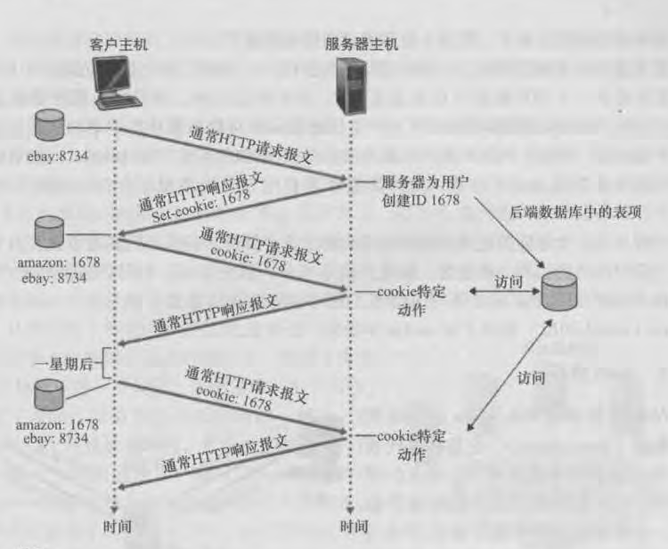

### HTTP概述
web的应用层协议是超文本传输协议http，它是web的核心，由RFC文档定义。http是一种文件传输协议，不止用于web应用，还可以被其他应用使用

http由客户程序和服务器程序实现：
  - 客户程序web浏览器。客户向服务器发送对该页面所包含对象的http请求报文，服务器收到请求后将这些对象通过http响应报文发送给客户
  - 目前流行的服务器由有Apache和Microsoft Internet Information Server
  - http使用TCP作为传输层协议，默认端口为80
  - 运行在TCP之上

web页面组成：
  - web页面(也称为web文档)是由对象组成的。一个对象只是一个文件，例如一个HTML文件、一个JPEG图形，一个java小程序等，它们可以通过URL地址寻址。多数web页面含有一个HTML基本文件以及几个引用对象
  - 在web中，request和response成对出现。例如web浏览器发送了一个html文本和三幅图像组成的web页面，服务器发送4个响应报文。

无状态协议：
  - http是无状态协议，服务器向客户发送请求的文件而不存储关于该客户的状态。如果某个特定用户在短时间内多次请求同一对象，服务器不会记得之前发生了什么，而是每次都重新发送该对象

持续连接&非持续连接
  - 如果客户向服务器发送多个请求，每个请求都经一个单独的TCP连接发送称为非持续连接
  - 如果这些请求通过相同的TCP连接发送称为持续连接，持续连接又可以分为流水线和非流水线
  - http默认模式是带流水的持续连接

#### http报文格式
http请求报文：
> GET /somedir/page.html HTTP/l.l 
> 分别表示：方法字段、路径、协议版本
> 
> Host: www.someschool.edu 
> 服务器域名
> 
> Connection: close 
> 表示发送完被请求对象后关闭连接
> 
> User-agent: Mozilla/5.0 
> 表示向服务器发送请求的浏览器的类型，服务器可以通过该首部行向不同类型的用户代理发送相同对象的不同版本(每个版本都由相同的URL寻址)
> 
> Accept-language: fr 
> 表示用户想得到的语言版本，没有则发送默认版本

htpp响应报文：
> HTTP/1.1 200 OK 
> 分别表示：协议版本、状态码、状态信息
>
> Connection: close 
> 表示传输完成后关闭连接
> 
> Date: Tue , 09 Aug 2011 15:44:04 GMT
> 产生该报文并且发送该报文的日期和时间
> 
> Server: Apache/2.2.3 (CentOS)
> 表示该报文由Apache服务器产生 
> 
> Last-Modified: Tue , 09 Aug 2011 15:11:03 GMT 
> 
> Content-Length: 6821 
> 发送对象的字节数
> 
> Content-Type: text/html 
> 表示发送对象为HTML文本
> 
> (data data data data data ...)
实体

http状态码和状态信息：
 - 200 OK：请求成功，信息在返回的响应报文中
 - 301 Moved Permanently：请求的对象已被永久转移，新的URL在响应报文的Location首部行中，客户将自动获取新的URL
 - 400 Bad Request：通用差错代码、该请求服务器不能理解
 - 404 Not Found：被请求的文档不在服务器上
 - 505 HTTP Version Not Support：服务器不支持报文使用的http版本

#### cookie
http服务器是无状态的，不维护客户端的状态，引入了cookie跟踪用户状态

cookie有四个组件：
  - http响应报文中的一个cookie首部行
  - http请求报文中的一个cookie首部行
  - 客户端保留一个cookie文件，由用户浏览器管理
  - web站点的一个后端数据库

浏览器向服务器传递一个cookie首部，服务器会为该用户创建一个表项存储在后端数据库中，该表项维持了客户状态(如账号密码，姓名等)。客户下次请求时，服务器会查询后端数据库，做出特定动作，客户就不用在输入密码，姓名等，服务器维护了客户的状态

#### web缓存
web缓存器也叫代理服务器，类似OS中的主存-缓存

客户向cache发送请求，如果cahe含有这个对象就发送被请求对象的响应；如果cahe没有，cahe就向服务器请求该对象并保存下来，然后发送给客户

web缓存通常由ISP购买并安装

优点：
  - 减少对客户请求的响应时间
  - 减低因特网上的web流量，改善所有应用的性能

缺点：
  - cahe中的对象副本可能是旧的

解决方法：http有一种机制，允许cache证实它的对象是最新的，这种机制叫做条件GET方法
  - 请求报文使用GET方法，并且请求报文中包含一个IF-Modified-Since首部行
  - 如果是满足条件是最新的对象副本，cache就发送给客户；如果不是最新的服务器就向cahe发送对象的响应报文，更新cache的对象副本，cache再发送给客户
