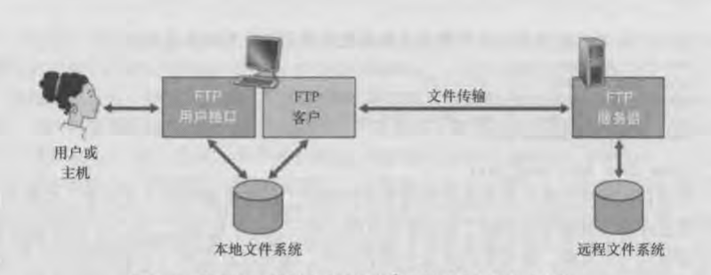

文件传输协议：FTP

HTTP和FTP都是文件传输协议，它们都运行在TCP之上。

FTP使用了两个并行的TCP连接传输文件。一个是控制连接，一个是数据连接。因为FTP使用一个独立的控制，所以也称FTP的控制信息是带外传送的，而HTTP控制信息和数据信息是在同一个TCP连接中发送的，称为带内发送控制信息的

在同一个会话期，如果用户还需要传输另一个文件，FTP则打开另一个数据连接。因此对FTP而言，控制连接贯穿整个会话期间，但是会话中的每一次文件传输都需要建立一个新的数据连接。即在会话期间，数据连接是非持续的，控制连接是持续的。

有状态协议：
  - FTP是有状态协议，在整个会话期间会保留用户的状态。对每个进行中的会话的状态信息进行追踪，大大限制了FTP能同时维持的会话总数