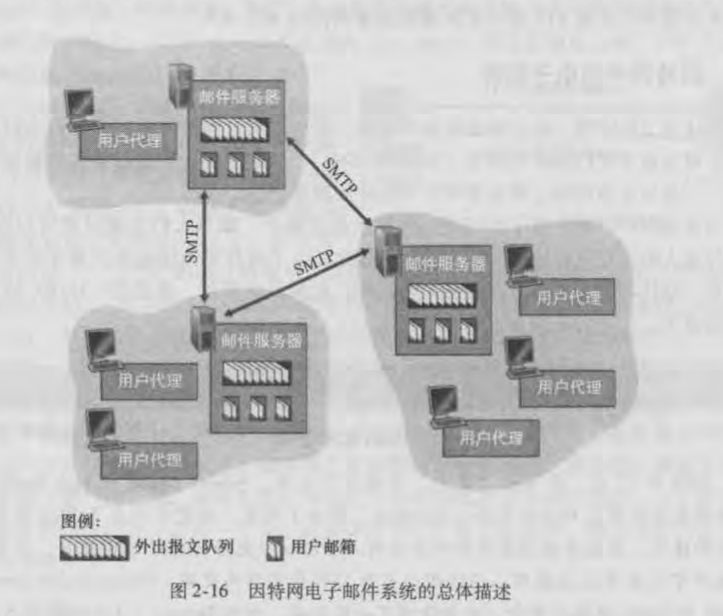

### 因特网电子邮件

email组成：
  - 用户代理
  - 邮件服务器
  - 简单邮件传输协议SMTP

用户代理允许用户阅读、回复、转发、保存、撰写报文。例如微软的outlook和Apple Mail

### SMTP
SMTP是因特网电子邮件中主要的应用层协议。它使用TCP可靠数据传输服务，从发送方的邮件服务器向接收方邮件服务器发送邮件。

SMTP组成：
  - 邮件服务器发送邮件时表现为客户端
  - 邮件服务器接收邮件时表现为服务端

SMTP是直接联系的：
  - SMTP一般不使用中间邮件服务器发送邮件，即使这两个邮件服务器位于地球的两端也是这样假设Alice的邮件服务器在中国香港,而Bob的服务器在美国圣路易斯，那么这个TCP连接也是从香港服务器到圣路易斯服务器之间的直接相连。特别的是，如果Bob的邮件服务器没有开机，该报文会保留在Alice的邮件服务器上并等待进行新的尝试，这意味着邮件并不在中间的某个邮件服务器存留

持续连接：
  - SMTP是持续连接，邮件服务器有几个报文发往同一个接收邮件服务器，它可以通过同一个TCP连接发送这些所有的报文

### SMTP vs HTTP
http从web服务器向web客户传送文件(对象)

smtp从一个邮件服务器向另一个邮件服务器传送文件(电子邮件报文)

持续的http和smtp都使用持续连接

区别一：
 - http主要是一个拉协议，即在方便的时候，先在web服务器上装载信息，用户使用http从服务器拉取这些信息。特别是TCP连接是由想接收文件的机器发起的
 - smtp基本上是一个推协议，即发送邮件服务器把文件推向接收邮件服务器。特别是TCP连接是由要发送该文件的机器发起的

区别二：
  - smtp要求每个报文使用7比特ASCII码格式，如果报文包含了非7比特ASCII格式或二进制文件，则发送方需要按7比特ASCII进行编码，接收方自己解码
  - http不受这种限制

区别三：
  - 如果文档既包含了文本又包含图形(即多种类型的媒体)，http把每个对象封装到它自己的http响应报文中，而smtp则把所有报文对象放在一个报文中

### 邮件访问协议
SMTP是推协议，用于将邮件从发送方的邮件服务器传输到接收方的邮件服务器；SMTP也用来将邮件从发送方的用户代理发传送到发送方的邮件服务器

但是取报文是一个取操作，如果用户代理想从邮件服务器上收取邮件，需要使用邮件访问协议。主流邮件访问协议包括：POP3、IMAP、HTTP

pop的两种工作模式：
  - 下载并保留，用户从邮件服务器上读取邮件后，邮件会保留在邮件服务器上，用户可再次从邮件服务器下载文件
  - 下载并删除，邮件一旦被读取，就从邮件服务器上删除
  - 说明：POP3是无状态协议

### 总结
传统的因特网email
> 用户代理向邮件服务器发送报文：SMTP
> 邮件服务器之间发送报文：SMTP
> 用户代理从邮件服务器取报文：POP3、IMAP、HTPP

基于web的email，用户代理就是普通的浏览器
> 用户代理使用http向邮件服务器进行收发报文
> 邮件服务器之间还是使用的SMTP

