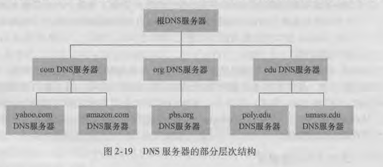
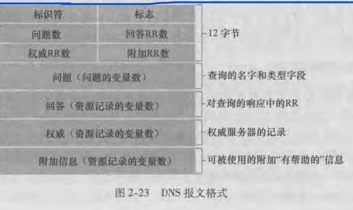

### DNS提供的服务
DNS(Domain Name System)，称为域名系统

DNS组成：
  - DNS服务器，一个由分层的DNS服务器实现的分布式数据库
  - DNS协议，一个使得主机能够查询分布式数据库的应用层协议，DNS协议运行UDP之上，使用53号端口

DNS协议是应用层协议，使用C/S模式运行在通信的端系统之间
  - 在通信的端系统之间通过下面的端到端传输协议来传送DNS报文
  - DNS不同于其他应用程序，它不和用户直接打交道。DNS为因特网上的用户应用程序以及其他软件提供一种核心功能，即将主机名转换为IP地址

DNS工作举例，以浏览器请求www.baidu.com页面为例。为了能使用户的主机能够将一个http报文发送到web服务器www.baidu.com，该用户主机必须获取www.baidu.com的IP地址
  - 用户主机上运行着DNS应用的客户端
  - 浏览器抽取出主机名www.baidu.com，并将这台主机名传给DNS应用的客户端
  - DNS客户向DNS服务器发送包含主机名的请求
  - DNS客户最终会受到一份应答报文，其中包含了www.baidu.com的IP地址
  - DNS客户将IP地址传送给浏览器，浏览器就能够向位于该IP地址80端口的HTTP服务器进程发起一个TCP连接

DNS除了提供主机名和IP的转换外，还提供一些重要服务
  - 主机别名
  - 邮件服务器别名
  - 负载分配

### DNS工作原理
DNS的一种简单设计是在因特网上只使用一个DNS服务器，该服务器包含所有域名和IP的映射，但因特网是一个庞大的系统，这种集中式设计的问题包括
  - 单点故障
  - 通信容量。单个DNS服务器需要处理来自所有DNS客户的请求
  - 远距离的集中式数据库。如果单台DNS服务器放在纽约市，如果客户端在中国，造成了严重的请求时延
  - 维护。单个DNS服务器需要为所有因特网主机保留记录，数据库庞大，维护困难

单一DNS服务器运行集中式数据库完全没有扩展能力，因此DNS采用的是分层次的分布式设计

> 根DNS服务器：全球共有13个根DNS服务器，根DNS负责管理所有顶级域服务器，拥有所有顶级域的权威服务器的IP
> 顶级DNS服务器：TLD DNS服务器负责管理下面的权威DNS服务器，拥有子域的权威服务器的IP
> 权威DNS服务器：权威服务器含有它所服务的域的所有主机的IP信息

### 本地DNS服务器
根、TLD和权威服务器都处在DNS服务器的层次结构中，还有另一类重要的DNS服务器，称为本地名称服务器。严格来说本地DNS服务器不属于DNS服务器层次结构，但它对DNS层次结构十分重要，每个ISP(如一个大学、一个系、一个公司或一个小区的ISP)都有一台本地DNS服务器(也叫默认名称服务器)

当主机发送DNS请求时，该请求被发往本地DNS服务器，它起着代理的作用，并将该请求转发到DNS服务器层次结构中。

DNS查询分为：
  - 迭代查询
  - 递归查询

### DNS缓存
DNS系统有一个十分重要的特色：DNS缓存。为了减小DNS请求时延，当某个DNS服务器接收到一个DNS应答(包含域名到IP的映射)时，它会将该回答中的信息缓存下来。由于主机和主机IP之间的映射不是永久的，cache通常在一段时间后会丢弃缓存信息(一般为两天)

例如：
  - 例如DNS客户向本地DNS服务器请求www.baidu.com，本地DNS服务器会将请求转发到DNS层次结构中
  - 本地DNS服务器收到应答后，会将应答缓存下来，再发送给DNS客户
  - 如果另外一个客户发起对www.com.baidu的请求，本地DNS服务器就直接将应答发给客户，不用再转发到DNS层次结构中查询其他DNS服务器，即使它不是权威DNS服务器

本地DNS也能够缓存TLD DNS服务器的域名和IP地址，因而本地DNS有时可以绕过DNS查询链中的根DNS服务器(这种情况经常发生)

### DNS资源记录
共同实现DNS分布式数据库的所有DNS服务存储了资源记录(Resource Record ，RR), RR提供了主机名到地址的映射。每个DNS回答报文包含一条或多条RR

资源记录是一个四元组，包含了以下字段：
  - (Name,Value,Type,TTL)

TTL是该记录生存时间，它决定了RR应当从缓存中删除的时间。Name和Value取决于Type。在下面给出的例子中，我们忽略TTL字段
  - Type = A，此Name表示规范主机名，Value表示IP，例如(relayl.bar.foo.com,145.37.93.126,A)
  - Type = CNAME，此时Name表示主机别名，Value表示规范主机名，例如(foo.com,relay.bar.foo.com,CNAME)
  - Type = NS，此时Name表示一个域,Value表示该域的权威DNS服务器的主机名，例如(foo.com,dns.foo.com,NS)
  - Type = MX,此时Name表示邮件服务器的主机别名，Value表示该邮件服务器的规范主机名，例如(foo.com,mail.bar.foo.com,MX)

### DNS报文
DNS报文只有查询和回答报文，并且查询报文和回答报文格式相同

  - 首部区域：前12字节为首部区域。标识符于标识查询，用于客户匹配发送的请求和接收到的回答；标志字段有若干标志位。
  - 问题区域：包含了名字字段Name和类型字段Type，分别指出了被查询的主机名字、有关该名字的问题类型
  - 回答区域：包含了对最初请求的主机名字的资源记录
  - 权威区域：包含了其他权威服务器的记录
  - 附加区域：包含了其他帮助信息。例如Type=MX时，回答区域给出了邮件服务器主机的规范名。而附加区域有一个类型A的资源记录，给出了这个邮件服务器的规范主机名的IP地址

