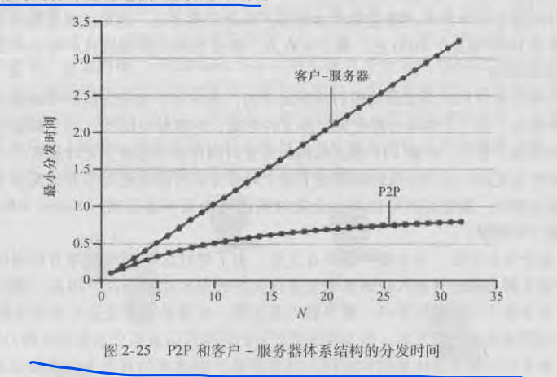

### P2P VS C/S
p2p自扩展性强，C/S扩展性弱

具有P2P体系结构的应用程序能够是自扩展的。这种扩展性的直接形成原因是:对等方既是客户方又是服务方

有两种特别适合于P2P体系结构的应用。第一种应用是文件分发，第二种是分布在大型对等方社区中的数据库。对于这个应用，我们将讨论分布式散列表

### 文件分发

对于P2p体系结构，最小分发时间不仅总是小于C/S体系结构的分发时间，并且对于任意的对等方数量N，总是小于1小时

说明：BiTorrent是一种用于文件分发的流行P2P协议。

用BiTorrent(比特流)的术语来说，参与某一个特定文件分发的所有对等方的集合被称为一个洪流。在一个洪流中的对等方彼此下载等长度的文件快，典型的块长度为256KB。
  - 上载&下载：当一个对等方首次加入洪流时，它没有块。随着时间流逝，它积累了越来越多的块。它下载块的同时也为其他对等方上载了多个快
  - 离开&留下：一旦某个对等方获得了整个文件，它也许离开洪流(自私)，也可能留在洪流中继续向其他对等方上载块(无私)。特别的是：任何对等方可能在任何时候仅具有块的子集就离开该洪流，并在以后重新加人该洪流中
  - 块子集：在任何给定时间，每个对等方将具有来自该文件的块子集，并且不同对等方具有不同的块子集

对等方请求文件块使用最稀缺优先技术：
> 洪流中的每个对等方会周期性的经TCP连接询问邻近对等方具有的块列表。通过这个信息，每个对等方向邻近对等方通过TCP连接发送请求，获取它的邻居中副本数量最少的块(最稀缺优先技术)

对等方响应/发送文件块使用的是一种对换算法：
> 上裁者：向自己注入速率最高的四个对等方。这四个对等方也叫做疏通。每过十秒重新计算这四个邻居
> 试探对等方：每30秒随机选取的一个对等方。
> 
> 响应：只会向上裁者和试探对等方发送文件块。
> 
> 说明：在向试探对等方发送文件块时，有可能称为对方的上裁者。对方也可能成为自己的上裁者。因为每30秒会随机重新选，也就是在不断寻找速率更合适的伙伴。

追踪器
  - 每个洪流都具有几个基础设施点，称为追踪器。当一个对等方加入某洪流时，它向追踪器注册自己，并周期性的通知追踪器它仍在洪流中。以这种方式，追踪器跟踪正参与在洪流中的对等方。

### 分布散列表
集中式数据库：该数据库只包含(键、值)对，例如键可以是身份证号，值是人名，如果使用集中式数据库，则所有数据都要存储在一个中心服务器上。

构建这种数据库的一个分布式、P2P的版本。我们在数以百万计的对等方上存储键值对，在该P2P系统中，每个对等方将保持键值对仅占总体的一个小子集。我们将允许任何对等方使用一个特别的键来查询该分布式数据库，分布式数据库则将定位拥有该键值对的对等方，然后向请求查询的对等方返回这个键值对。任何对等方也允许在数据库中插入新的键值对。这样的一种分布式数据库称为分布式散列表DHT
