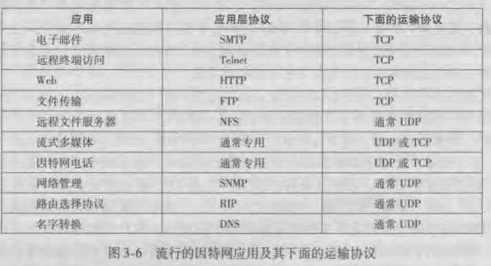

### 运输层和网络层关系
运输层将网络层端到端的交付服务扩展到两个不同端系统上的应用层进程之间的交付服务

运输层协议是在端系统中实现而不是在路由器上实现的。

注意：网络路由器仅作用于IP数据报的网络层字段，即它们不检查封装在IP数据报中的运输层报文端字段。

网络应用程序可以使用多种运输层协议。因特网有两种协议，TCP和UDP。每种协议都能为调用的应用程序提供一组不同的运输层服务。

因特网网络层协议中有一个最重要的协议叫做IP，即网际协议。它是将各个网络的粘合剂，它将各个网络相连，形成了网络的网络(因特网)。

IP的服务模型是尽力而为交付服务(best-effort delivery service)，它只在主机之间交付报文端，不做任何保障。IP被称为不可靠服务。

> 运输层为运行在不同主机上的应用进程之间提供逻辑通信。
> 
> 网络层为不同主机提供逻辑通信。

### 运输层服务
多路复用和多路分解：将主机间交付扩展到进程间的交付被称为运输层的多路复用和多路分解。

UDP连接支持1对1、一对多、多对一、多对多。
TCP连接支持一对一。

TCP：传输控制协议。
  - 可靠的、面向连接的服务
  - 进程到进程的数据交付
  - 可靠数据传输
  - 流量控制
  - 拥塞控制
  - 安全性(SSL)

UDP：用户数据报协议。
  - 不可靠的、无连接的服务
  - 进程到进程的数据交付
  - 差错检查

TCP和UDP都无法提供时延和带宽的保证。

可靠传输：
  - TCP通过流量控制、序号、确认和定时器。确保正确地，按序地将数据从发送进程交付给接收进程。这样，TCP就将IP服务转换并加强成了一种进程间的可靠数据传输服务。

拥塞控制：
  - 拥塞控制是面向整个因特网的，防止任何一条TCP连接用过多六老尼姑淹没了通信主机之间的链路和交换设备。
  - TCP力求为每个通过一条拥塞网络链路的连接*平等地*共享网络。

