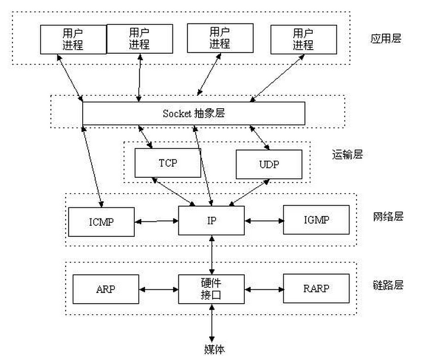
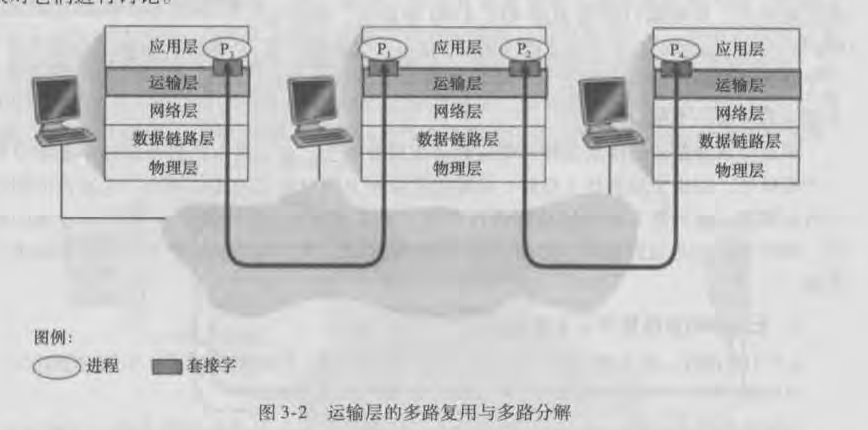

### 多路复用和多路分解
运输层的多路复用与多路分解，也就是将网络层提供的主机之间的交付服务 ——> 进程之间的交付服务

多路复用和多路分解是所有计算机网络都需要的。

一个进程有一个或多个套接字，它相当于从网络向进程传递数据和从进程向网络传递数据的门户。

  - 将运输层报文段中的数据交付到正确的socket称为多路分解。
  - 源主机从不同socket收集数据块，并为每个块附加上首部信息(用于以后分解)从而生成报文段，然后将报文段传递到网络层，称为多路复用。

运输层多路复用的要求：
  - 套接字有唯一标识符
  - 每个报文段由源端口和目的端口指示该报文段所要交付到的套接字。

port：16bit。0~1023为周知端口，在RFC文档中定义。
  
### 无连接的多路复用与多路分解
一个UDP套接字是一个二元组，包含了目的IP和目的端口号。

如果两个UDP报文段的目的IP和目的port相同，那么这两个报文段将通过相同的目的套接字被定向到相同的目的进程。

### 面向连接的多路复用与多路分解
TCP套接字是一个四元组，包含了源IP、源port、目的IP、目的port。

服务器主机可以支持很多并行的TCP套接字，每个套接字与一个进程相联系，并由其四元组来标识每个套接字。

当一个TCP报文段到达主机时，所有4个字段被用来将报文段定向到相应的套接字。

