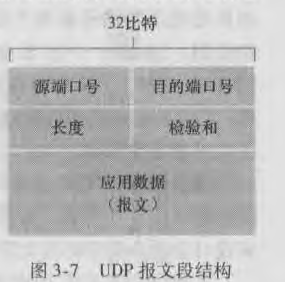

### UDP
UDP优点：
  - 关于何时发送、发送什么数据的应用层控制更为精细。随时想发就发。
  - 无需连接建立，速度快。适合实时应用。
  - 无连接状态。TCP需要在端系统中维护连接状态。此连接状态包括接收和发送缓存、拥塞控制参数、序号、确认号等参数。某些支持特定应用的服务器当应用程序运行在UDP之上时而不是TCP时，可以支持更多用户，因为UDP不维护连接状态，也不跟踪这些参数。
  - 分组首部开销小。

使用UDP的应用是可以实现RDT的。可以通过在应用程序自身实现建立可靠机制(例如序号、确认、重传机制...)来实现RDT。

UDP只在IP服务的基础上增加了差错检测和多路复用与多路分解。

### UDP报文段结构

UDP首部只有四个字段，每个字段由两个字节组成。
  - 长度指明了包括首部在内的UDP报文段长度(以字节为单位)
  - 检验和，检查当UDP报文段从源到目的地时，其中的比特是否发生了改变。
