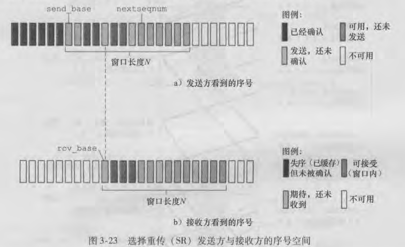

# 可靠数据传输原理
可靠传输的实现不仅在运输层出现，也会在链路层以及应用层出现。

可靠数据传输的三种协议:
  - 停止-等待协议(stop-wait)
  - 回退N帧GBN
  - 选择重传SR

GBN和SR都属于流水线协议

我们使用有限状态机FSM描述可靠数据传输。

# 停止-等待
我们逐步分析如何实现可靠数据传输

## rdt1.0
说明：底层信道是完全可靠的
1
发送方和接收方无需采取任何措施，直接进行数据的发送和接收

## rdt2.0
说明：只考虑比特差错

Question：假设分组在传输、传播或缓存的过程中，不会出现超时，失序等错误。但有可能出现比特差错，比特差错通常发生在网络的物理部件中

Solution：接收方收到分组进行差错检查。正确则发送肯定确认ACK，发送方收到ACK后就可以发送下一个分组。错误则发送NCK，发送方收到NCK后重新发送分组。基于这样重传机制的传输协议被称为自动重传请求ARQ。

ARQ协议还需要另外三种协议功能来处理比特差错的情况：
  - 差错检测
  - 接收方反馈ACK和NCK
  - 重传

## rdt2.1
说明：考虑了ACK和NCK的比特差错

Question：rdt2.0有一个致命缺陷没有考虑ACK和NCK分组出现比特差错，如果ACK和NCK出现比特差错，发送方无法知道接收方是否正确接收到了分组

Solution：给分组增加序号，对于停止等待协议，1bit序号就足够了。采用模2运算向前移动

rdt2.1的ARQ：
  - 差错检测
  - 接收方反馈ACK和NCK
  - 重传
  - 序号

## rdt2.2
在rdt2.1的基础上去掉了NCK
  - 如果发送的是1号分组，正确则发送ACK=1，错误发送ACK=0
  - 如果发送的是0号分组，正确则发送ACK=0，错误发送ACK=1

序号不仅可以解决发送方反馈信号出现比特差错的错误，还可以解决冗余分组的问题。

## rdt3.0
说明：只考虑比特出错和分组丢失

Question：分组在传输过程中可能出现丢失。如果分组丢失，不采取一定措施，那么接收方和发送方就会陷入一直等待的状态。

Solution：引入了超时重传机制，要实现超时重传机制，需要一个倒计时定时器。

发送方：
  - 每发送一个分组(包括第一次分组和重传的分组)，启动一个定时器。
  - 响应定时器中断
  - 终止定时器

rtd3.0的ARQ：
  - 差错检测
  - 接收方反馈ACK和NCK
  - 重传
  - 序号
  - 定时器(超时重传)

## 停止等待协议的缺点
Question：由于是停等协议，对链路利用率太低。

Solution：引入了流水线协议GBN和SR
  - 增加序号范围。
  - 协议发送方和接收方必须缓存多个分组
  - 所需序号范围和对缓冲的要求取决于数据传输协议如何处理丢失、损坏以及延时过大的分组

k：用来给分组编号的比特数，决定了序号范围
n：n<=k，决定了窗口大小
|发送窗口大小|接收窗口大小|协议类型|
|---|---|---|
|1|1|停止等待|
|2^n|1|GBN|
|2^n|2^n|SR|

# GBN
GBN也常被称为滑动窗口协议。
  - send_window = 2^n 
  - rec_window = 1
  - 累计确认，每次发送分组只启动一个定时器
  - 不允许乱序到达
  - 重传时重传所有已发送但未被确认的分组

分组序号承载在分组首部的一个固定长度的字段中。如果分组序号的比特数是k。则序号范围为[0,2^k-1]。
  - 例如TCP有一个32bit的序号字段，其中TCP序号是按字节流中的字节进行计数(编号)的，而不是按分组计数(编号)
  - 在一个有限的序号范围内，所有涉及序号的运算必须使用模2\^k。即序号空间可被看作一个长度为2\^k的环，其中序号2\^k-1紧接着序号0

  - (-oo,base-1]，已发已确认的分组，窗口外
  - [base,nextseqnum-1]，已发送未确认
  - [nextseqnum,base+N-1]，窗口剩余可用空间
  - [base+N,+oo)，窗口外，不可用

GBN发送方必须响应三种类型的事件
  - 缓存数据(发送方并不立刻发送这些数据)。或者使用同步机制(如一个信号量或标志)允许上层在仅当窗口不满时才可以调用rdt_send()。
  - 接收ACK。GBN采用累计确认，对序号为n的分组采用累计确认，表示接收方已正确收到n及n以前的分组。
  - 超时重传，重传所有已发送但还未被确认过的分组。只有一个计时器，这个计时器作为序号最小的未确认的分组的计时器

GBN接收方
  - 正确收到分组，发送累计确认ACK。
    - 假设接收方收到序号为n的分组，暂时不发送ACK=n，为序号为n的分组启动一个辅助计时器。如果该时间内，序号为n+1的分组正确到达。则关闭n号分组计时器，为n+1号分组启动定时器。如果该时间内，序号为n+1的分组未正确到达。则立即发送ACK=n，并关闭计时器。
  - 丢弃所有出错分组和所有失序分组，等待发送方根据GBN重传规则重传
    - 例如分组n丢失，n+1到达。丢弃n+1。接收方发送ACK=n-1，发送方重传n及n之后的已发但未确认的分组
    - 例如分组n出错，丢弃n。n+1之后的即使原本是按序到达的，但此时窗口是接收分组n的窗口，n+1到达后失序被丢弃。超时后，接收方重传n及n之后的已发但未确认的分组。

# SR
选择重传协议
  - send_window = 2^n 
  - rec_window = 2^n
  - 逐个确认，每发送一个分组就启动一个定时器
  - 允许乱序到达
  - 只重传出错或者丢失的那个分组。

SR发送方的事件以及动作
  - 从上层接收数据，如果数据位于窗口范围内，则将数据打包发送。否则就像GBN一样缓存。
  - 超时重传。每个分组都具有自己的逻辑定时器。
  - 接收ACK。如果分组序号在窗口内就将被确认的分组标为已接收。如果ACK序号等于send_base，则窗口向前移动到序号最小的未确认分组处。

SR接收方
  - 分组可以乱序到达，失序的分组可以被接收。逐个确认
  - 序号在接收窗口内的分组正确接收，发送确认分组。序号小于rcv_base的分组(即以前接收过的分组),发送ACK。其他情况忽略分组。

因为SR收发两方窗口存在同步问题，所以对于SR而言，窗口长度必须<=序号空间大小的一半，否则协议无法工作。

# RDT总结

