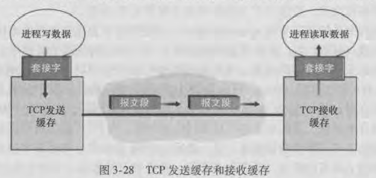
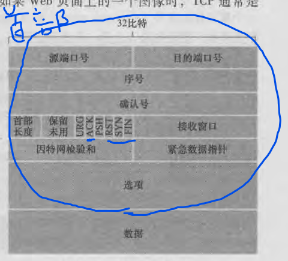
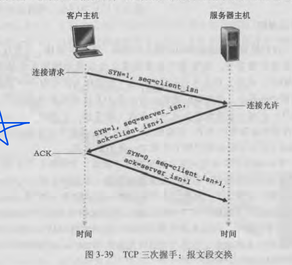
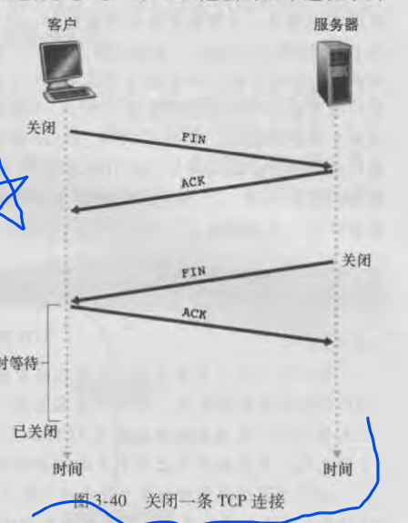

# TCP连接
TCP是面向连接的，两个应用进程发送数据前，这两个进程必须先进行三次握手。即它们必须先发送某些预备报文段和确保连接建立的参数。连接双方都将初始化与TCP连接相关的许多TCP状态变量。

TCP的连接状态由端系统维持，中间的网络元素(路由器和链路层交换机)不会维持TCP连接状态，它们对TCP连接完全不可见，它们看到的是数据报，而不是连接。

TCP提供的是全双工服务。TCP连接是点对点的，即在单个发送方和单个接收方之间的连接。

## TCP连接组成
TCP连接组成
  - 两台主机上的缓存
  - 两台主机上的套接字
  - 两台主机上的状态变量。例如序号、接收窗口

> TCP可以从缓存中取出或发送的报文段的数据数量受限于MSS
> MSS：最大报文段大小，通常由最初确定的MTU确定
> MTU：本地发送主机发送的最大链路层帧长度
> 路径MTU：从源到目的地的所有链路上发送的最大链路层帧
> 注意：MSS指的是报文段里应用层数据的最大长度，而不是包括TCP首部的TCP报文段的最大长度

## TCP报文结构

- 源端口和目的端口用于多路复用/分解
- 检验和字段，检验分组是否出错
- 32比特序号字段和32比特确认号字段，这些字段用于实现TCP发送方和接收方实现RDT
- 16比特的接收窗口，该字段用于流量控制
- 4比特首部长度，它指示了以32比特的字为单位的TCP首部长度。通常选项字段为空，所以TCP首部典型长度为20字节
- 6比特标志字段。ACK用于对成功接收报文段的确认。RST、SYN、FIN用于连接建立和拆除。PSH、URG和紧急数据指针在实际中通常没有使用。

# 序号和确认号
TCP将数据看作一个无结构、有序的字节流。

网络中的字节流是大端方式，即将第一个字节认作高位。

序号：一个报文段的序号是该报文段首字节的字节流编号。

确认号：主机希望从另一台主机收到的下一字节的序号。

TCP差错恢复机制采用的是SR和GBN混合的方式。
  - sender：重传，发送方只重传未确认的序号最小的报文段(像SR)。每次发送只启动一个计时器(像GBN)
  - receiver：累积确认，接收方只发送序号最大的报文段的ACK(像GBN)

# 往返时间估计

# 可靠传输。

# 快速重传
当TCP接收方收到一个序号大于下一个所期望的、按序的报文段时，它检测到数据流中间的一个隔断。
  - 因为TCP使用确认和超时重传保证可靠传输，所以接收方不能向发送方显式的发回否定确认。它就会对序号最大的报文段进行重复确认。(即产生冗余ACK)。
  - 一旦接收方收到3个冗余ACK，TCP就会快速重传，重传序号最小的未确认的报文段。

# 流量控制
TCP通过让发送方维持一个接收窗口的变量来提供流量控制。
  - 接收窗口用于给发送方一个指示：该接收方还有多少可用的缓存空间
  - 这个变量通常由发送方通过捎带技术告诉接收方

因为TCP是全双工通信，所以在连接两端。双方都各自维持了一个接收窗口。指示了对方剩余的缓存大小。

# TCP连接管理
建立连接SYN

  - 第三次握手一般通过捎带技术与数据一起发送给对方。

---

关闭连接FIN

  - sender、receiver都可以关闭连接

---

RST：用于主机向源发送一个特殊重置报文段。目的主机将TCP报文段的RST置1，告诉源主机：该目的主机没有那个报文段的套接字，请不要再发送该报文段了。

例如主机A使用nmap端口扫描工具向主机B的TCP 6780端口发送一个特殊的TCP SYN报文段来请求连接。可能出现三种情况
  - 主机B的TCP 6780端口有程序运行，nmap返回打开
  - 主机B的TCP 6780端口没有程序运行，源主机从目的主机收到一个TCP RST报文段。
  - 源什么也没收到。很可能该SYN报文段被中间的防火墙阻挡了。
