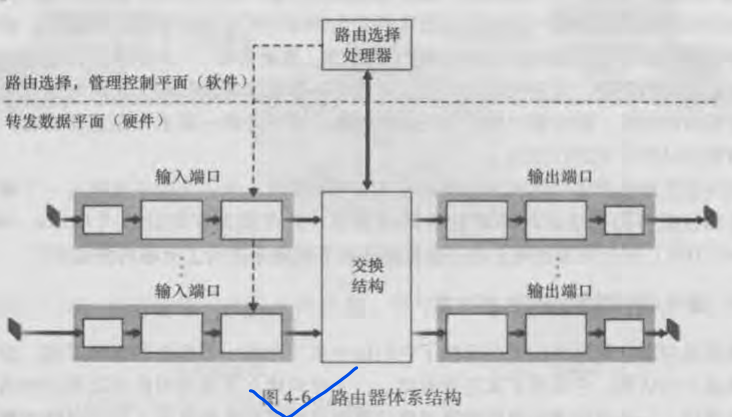
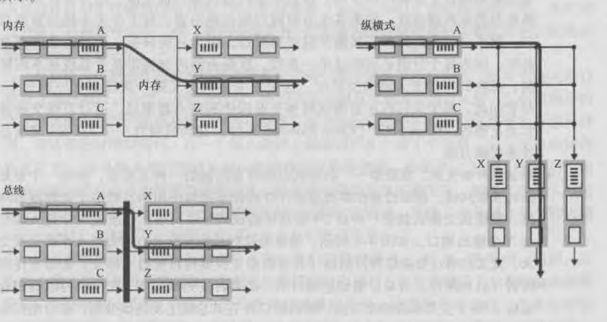

## 路由器工作原理
路由器组成：
 - 输入端口口
 - 交换结构
 - 输出端口
 - 路由选择处理器



输入端口功能：
 ``` 
    1.将输入的物理链路与路由器物理上相连
    2.执行位与 位于入链路远端的 数据链路层交互的数据链路层功能
    3.完成查找工作，查询转发表表项决定输出端口。
 ```

交换结构功能：
 ```
    将路由器的输入端口与输出端口相连接。

    说明：这种交换结构完全包含在路由器中
 ```

输出端口功能：
 ```
    1.存储从从交换结构接收的分组
    2.转发
    3.执行所需的链路层和物理层传输功能
 ```

 路由选择处理器功能：
 ```
    1.执行路由选择协议
    2.维护路由选择表、连接的链路状态信息
    3.为路由器计算和更新转发表
 ```
 
路由器：转发功能、路由功能。
> 一台路由器的输入端口，输出端口和交换结构共同实现了转发功能，并且总是使用硬件实现。

## 输入端口
存储转发表副本：路由选择处理器计算的转发表，通常会存储一份影子副本在每个输入端口。
 > 有了影子副本，路由决策能在本地执行，无须调用中央选择处理器，避免了集中式处理的瓶颈。

输入端口作用总结：
 - 前面所述的链路层处理和物理层处理
 - 检验分组
 - 查找转发表
 - 更新用于网络管理的计数器

输入端口的`匹配加动作`抽象执行在许多网络设备中，而不仅在路由器中，例如链路层交换机。

## 交换机构
交换机构的三种交换方式：
 - 经内存交换
 - 经总线交换
 - 经互联网络交换



纵横式网络能够并行转发多个分组，内存和总线型一次只能转发一个分组。

## 输出端口
``` 
    从输出端口内存中 -> 选择分组 -> 取出分组 -> 传输到输出链路
```
