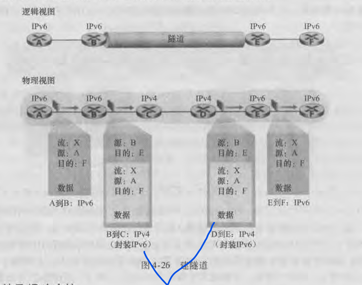

## 网际协议
IP数据报分片：
 ```
   IP数据报会被分片，然后在端系统重新组装。

   原理：
   假设有3条不同的链路（可以看做是3个网络）由一个路由器互联
   ->
   3条链路运行着各不相同的链路层协议，它们具有不同的MTU 
   ->
   相互通信时，它们发送出去的帧长度和其他链路并不匹配
   ->
   因此，IP数据报会被分为多个小的IP数据报，称为片
   ->
   数据报在端系统重新组装
 ```

片重构：
 - 数据报到达目的主机后，只有当数据报被完全重构为初始IP数据报时，才会被传递给目的主机的运输层。否则丢弃（如果运输层是TCP，此时会触发TCP都重传机制）

## IPv4编址
主机和物理链路之间的边界叫做接口，路由器拥有两个及两个以上接口（互联）。

IP地址技术是`与接口相关`的，一个接口对应一个IP地址。

IPv4编址发展阶段：`分类编址` -> `掩码` -> `无类别域间路由选择(CIDR)`

IP数据报在转发路由时是以`网络为单位`的，根据`路由聚集`和`最长前缀匹配`来进行。只有到达了一个网络组织内部时，网络号后面的主机号才会起作用。

## IPv6编址
ip地址为128比特

IPv6不允许在中间路由器进行分片和重组，只能在源主机和目的主机执行。

ICMPv6：在ICMP的基础上增加了`分组太大`、`未识别的IPv6选项`等功能，融入了IGMP（在IPv4中是独立的协议）。

## IPv4到IPv6的迁移
出现的问题：
   - IPv6能兼容IPv4，但已部署的IPv4不能处理IPv6数据报

解决办法：
1.双栈技术，IPv6同时具有IPv6和IPv4的实现
 - 由DNS实现，若解析的结点是IPv6使能的，则返回一个IPv6地址；否则返回IPv4地址
 - 若通信双方都为IPv6使用，则使用IPv6；若其中一方及以上为IPv4使能，则使用IPv4

2.隧道技术
 - IPv4将IPv6数据报当作数据封装在IPv4的数据报中，到达IPv6后拆开。
 - <br>

      